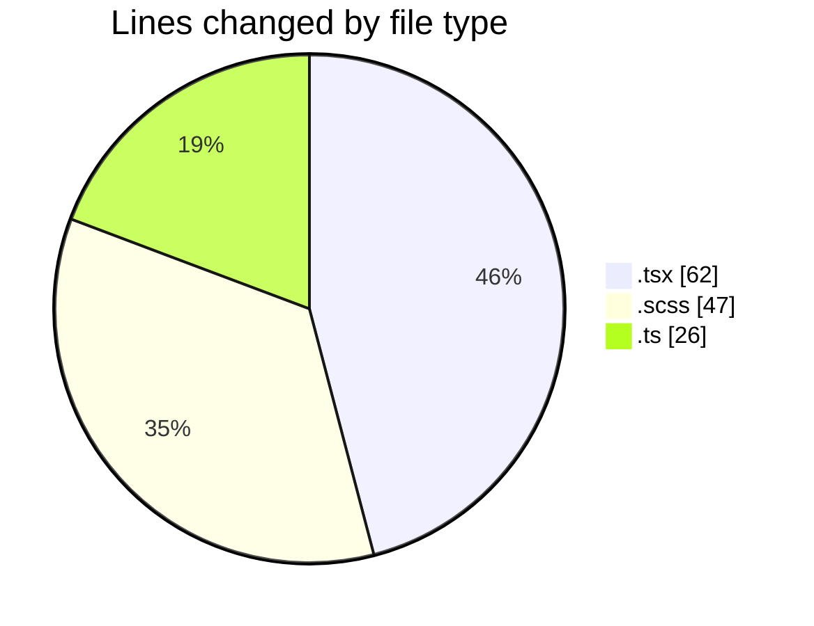
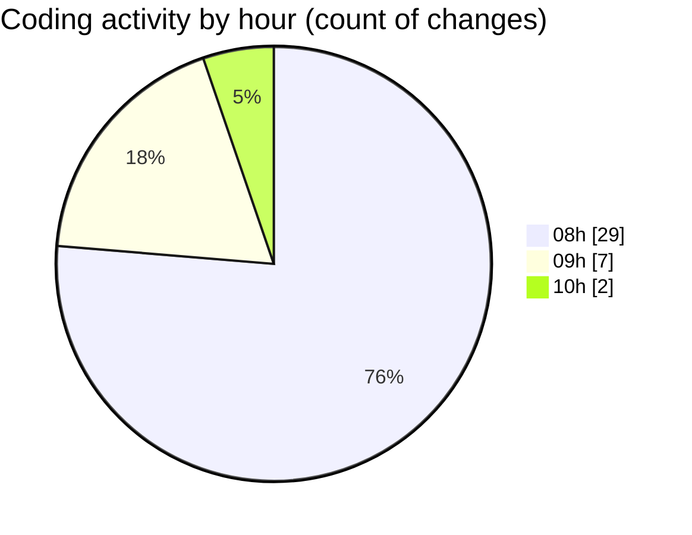

# cda - Activity Summary 

## Overall Statistics

| Stat                   | Value                                                             |
| ---------------------- | ----------------------------------------------------------------- |
| **Lines Added** (➕)   | 100                                          |
| **Lines Removed** (➖) | 35                                        |
| **Net Change** (↕)    | 65                |
| **Active Time** (⌚)   | 63 minutes |

## Modified Files
- **HelperModal.tsx** (+52, -6)
- **App.scss** (+29, -18)
- **DetailsField.tsx** (+2, -2)
- **types.d.ts** (+17, -9)

## Visualizations

### By File Type (Lines Changed)

### By Hour (Estimated Activity Count)

> **Last Updated:** 09/04/2025, 10:05:14