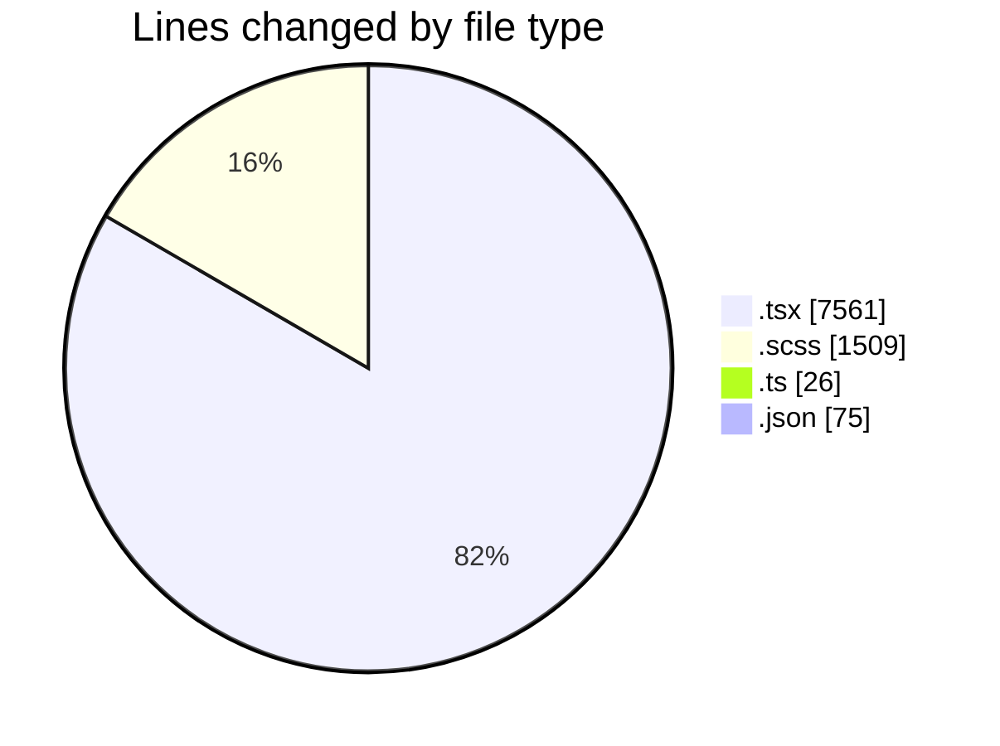
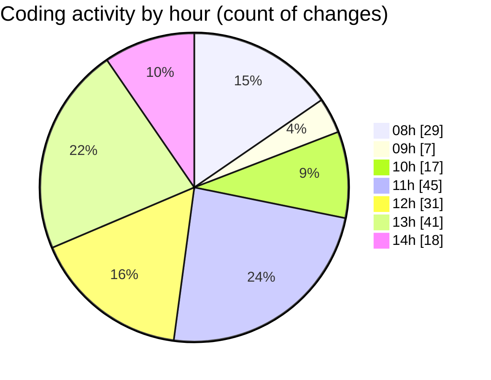

# cda - Activity Summary 

## Overall Statistics

| Stat                   | Value                                                             |
| ---------------------- | ----------------------------------------------------------------- |
| **Lines Added** (➕)   | 8177                                          |
| **Lines Removed** (➖) | 994                                        |
| **Net Change** (↕)    | 7183                |
| **Active Time** (⌚)   | 253 minutes |

## Modified Files
- **HelperModal.tsx** (+555, -6)
- **App.scss** (+794, -496)
- **DetailsField.tsx** (+198, -24)
- **types.d.ts** (+17, -9)
- **settings.json** (+75, -0)
- **App.tsx** (+512, -12)
- **PoolPositionAmountsPanel.tsx** (+216, -14)
- **Panel.tsx** (+53, -21)
- **CostDetails.scss** (+25, -4)
- **PoolDetails.scss** (+36, -4)
- **PoolEvent.scss** (+63, -2)
- **PoolPosition.tsx** (+662, -112)
- **PoolPositions.tsx** (+1019, -172)
- **PoolDetails.tsx** (+398, -4)
- **CostDetails.tsx** (+290, -1)
- **CostActuals.tsx** (+122, -0)
- **ReinvestmentDetail.tsx** (+555, -30)
- **InitiativeDetails.tsx** (+724, -72)
- **PoolEvent.tsx** (+135, -6)
- **PoolEvents.tsx** (+76, -1)
- **Home.tsx** (+58, -2)
- **StackedBarChart.tsx** (+197, -0)
- **StackedBarChart.scss** (+13, -1)
- **DetailsGrid.scss** (+71, -0)
- **RequestLetter.tsx** (+431, -1)
- **RequestLetter.test.tsx** (+882, -0)

## Visualizations

### By File Type (Lines Changed)

### By Hour (Estimated Activity Count)

> **Last Updated:** 09/04/2025, 14:30:07