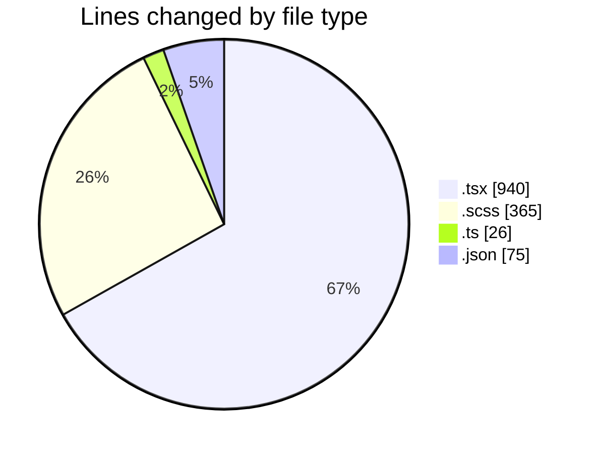
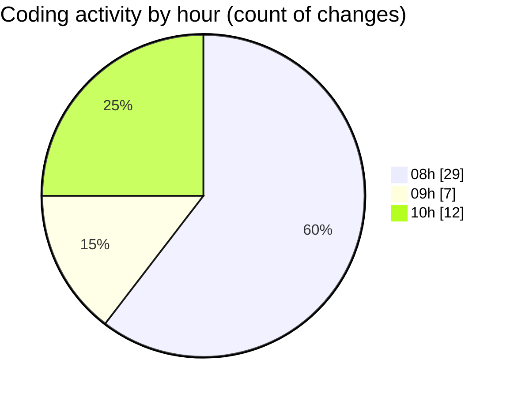

# cda - Activity Summary 

## Overall Statistics

| Stat                   | Value                                                             |
| ---------------------- | ----------------------------------------------------------------- |
| **Lines Added** (➕)   | 1369                                          |
| **Lines Removed** (➖) | 37                                        |
| **Net Change** (↕)    | 1332                |
| **Active Time** (⌚)   | 79 minutes |

## Modified Files
- **HelperModal.tsx** (+52, -6)
- **App.scss** (+345, -20)
- **DetailsField.tsx** (+178, -2)
- **types.d.ts** (+17, -9)
- **settings.json** (+75, -0)
- **App.tsx** (+500, -0)
- **PoolPositionAmountsPanel.tsx** (+202, -0)

## Visualizations

### By File Type (Lines Changed)

### By Hour (Estimated Activity Count)

> **Last Updated:** 09/04/2025, 10:25:06