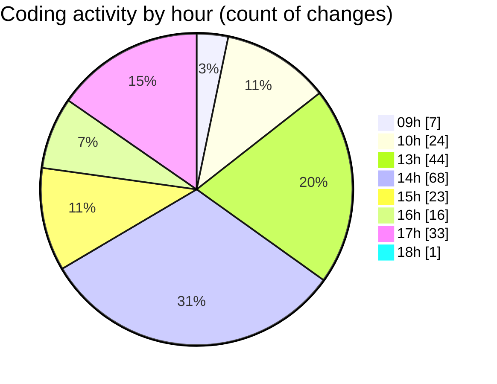

# cda - Activity Summary 

## Overall Statistics

| Stat                   | Value                                                             |
| ---------------------- | ----------------------------------------------------------------- |
| **Lines Added** (➕)   | 3188                                          |
| **Lines Removed** (➖) | 718                                        |
| **Net Change** (↕)    | 2470                |
| **Active Time** (⌚)   | 298 minutes |

## Modified Files
- **HelperModal.tsx** (+510, -0)
- **DetailsToolTip.scss** (+177, -106)
- **DetailsToolTip.tsx** (+768, -555)
- **App.scss** (+217, -0)
- **App.tsx** (+1000, -0)
- **CostActuals.test.tsx** (+167, -0)
- **InitiativeForecasts.test.tsx** (+349, -57)

## Visualizations

### By File Type (Lines Changed)

### By Hour (Estimated Activity Count)

> **Last Updated:** 10/04/2025, 18:07:13