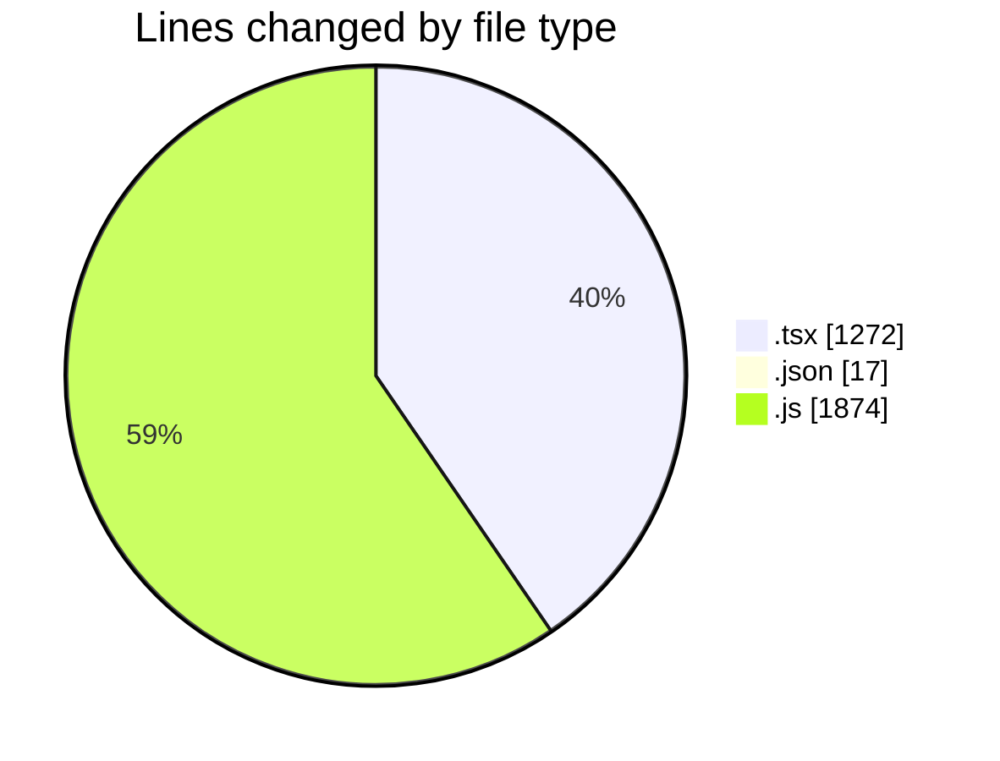
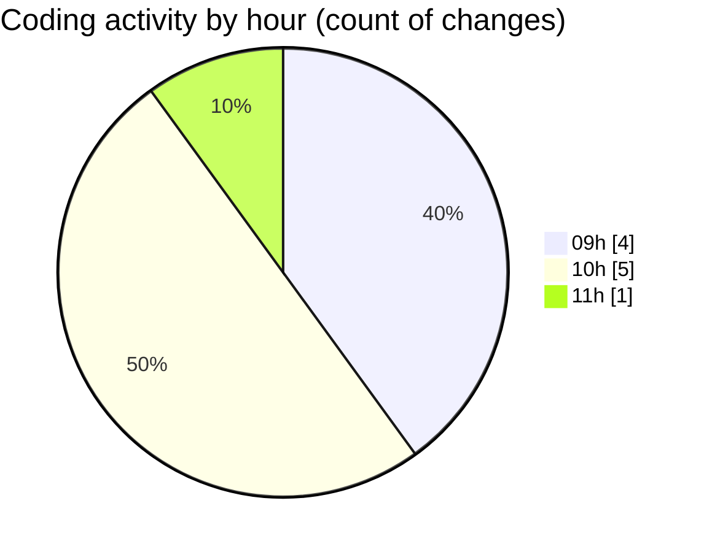

# cda - Activity Summary 

## Overall Statistics

| Stat                   | Value                                                             |
| ---------------------- | ----------------------------------------------------------------- |
| **Lines Added** (➕)   | 3130                                          |
| **Lines Removed** (➖) | 33                                        |
| **Net Change** (↕)    | 3097                |
| **Active Time** (⌚)   | 7 minutes |

## Modified Files
- **App.tsx** (+499, -0)
- **HelperModal.tsx** (+510, -29)
- **package.json** (+17, -0)
- **App.tsx** (+234, -0)
- **duties.js** (+241, -0)
- **allocate.js** (+220, -4)
- **duties.test.js** (+1409, -0)

## Visualizations

### By File Type (Lines Changed)

### By Hour (Estimated Activity Count)

> **Last Updated:** 28/04/2025, 11:05:49