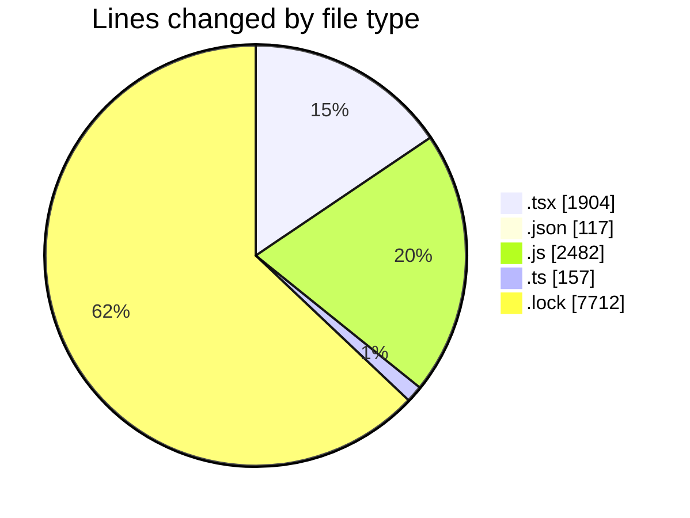
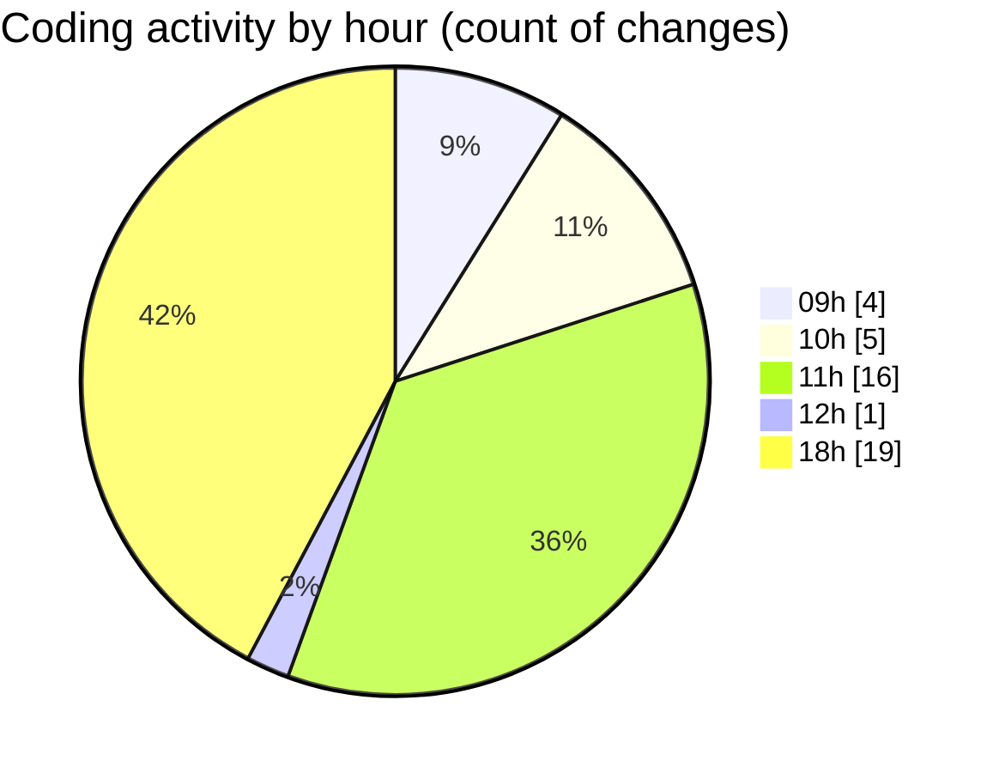

# cda - Activity Summary 

## Overall Statistics

| Stat                   | Value                                                             |
| ---------------------- | ----------------------------------------------------------------- |
| **Lines Added** (➕)   | 12265                                          |
| **Lines Removed** (➖) | 107                                        |
| **Net Change** (↕)    | 12158                |
| **Active Time** (⌚)   | 47 minutes |

## Modified Files
- **App.tsx** (+499, -0)
- **HelperModal.tsx** (+510, -29)
- **package.json** (+17, -0)
- **App.tsx** (+234, -4)
- **duties.js** (+241, -0)
- **allocate.js** (+233, -17)
- **duties.test.js** (+1409, -0)
- **allocate.ts** (+157, -0)
- **allocate.js** (+582, -0)
- **yarn.lock** (+7712, -0)
- **App.tsx** (+61, -0)
- **settings.json** (+98, -2)
- **Admin.tsx** (+186, -3)
- **RequestView.tsx** (+258, -50)
- **RequestView.test.tsx** (+68, -2)

## Visualizations

### By File Type (Lines Changed)

### By Hour (Estimated Activity Count)

> **Last Updated:** 28/04/2025, 18:30:49