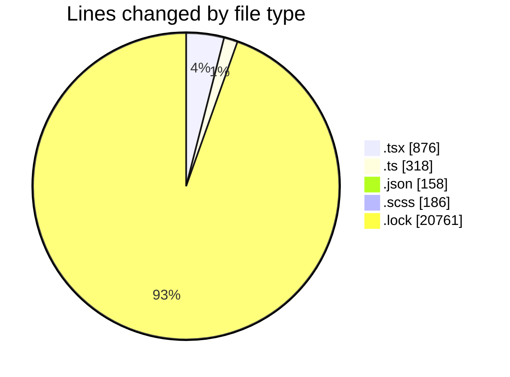
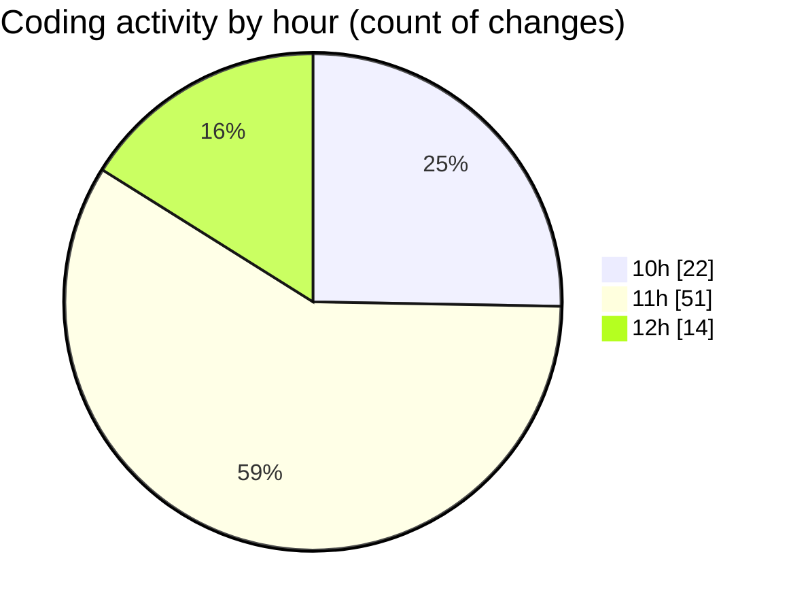

# cda - Activity Summary 

## Overall Statistics

| Stat                   | Value                                                             |
| ---------------------- | ----------------------------------------------------------------- |
| **Lines Added** (➕)   | 22163                                          |
| **Lines Removed** (➖) | 136                                        |
| **Net Change** (↕)    | 22027                |
| **Active Time** (⌚)   | 119 minutes |

## Modified Files
- **ProfilePhoto.tsx** (+143, -17)
- **types.d.ts** (+84, -27)
- **tsconfig.json** (+26, -4)
- **index.ts** (+3, -0)
- **AdminView.tsx** (+243, -19)
- **App.tsx** (+61, -0)
- **declarations.d.ts** (+84, -46)
- **Admin.tsx** (+180, -15)
- **queries.ts** (+71, -0)
- **index.ts** (+3, -0)
- **ProfilePanel.tsx** (+133, -5)
- **ProfilePanel.scss** (+93, -1)
- **package.json** (+63, -0)
- **yarn.lock** (+7712, -0)
- **package.json** (+65, -0)
- **yarn.lock** (+13049, -0)
- **ProfilePanel.scss** (+92, -0)
- **ProfilePanel.test.tsx** (+58, -2)

## Visualizations

### By File Type (Lines Changed)

### By Hour (Estimated Activity Count)

> **Last Updated:** 29/04/2025, 12:21:30