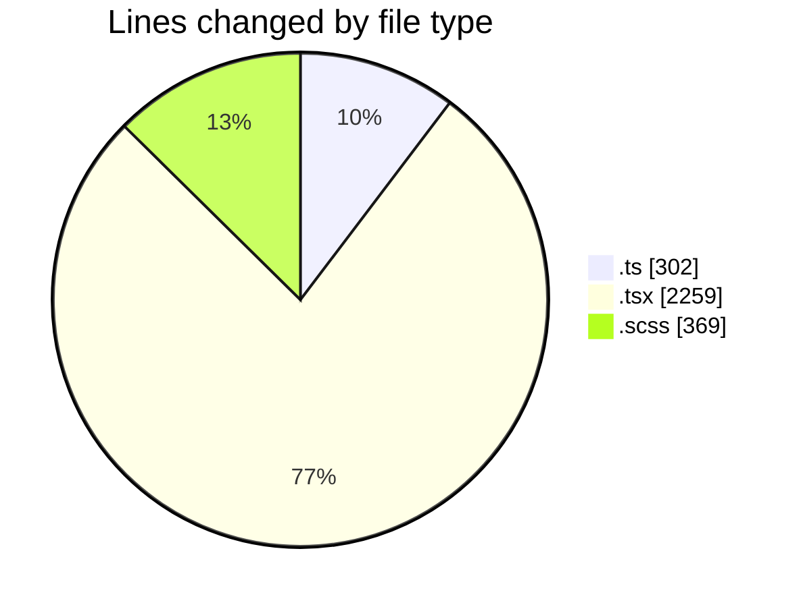
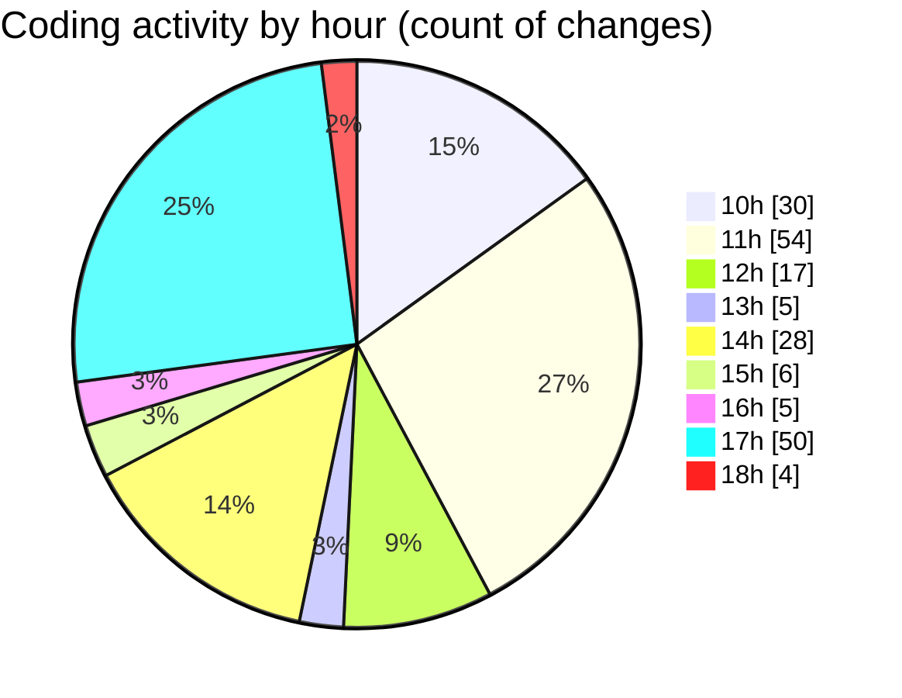

# cda - Activity Summary 

## Overall Statistics

| Stat                   | Value                                                             |
| ---------------------- | ----------------------------------------------------------------- |
| **Lines Added** (➕)   | 2259                                          |
| **Lines Removed** (➖) | 671                                        |
| **Net Change** (↕)    | 1588                |
| **Active Time** (⌚)   | 292 minutes |

## Modified Files
- **useRequestModal.ts** (+36, -0)
- **useDutyRequestTable.ts** (+93, -40)
- **types.ts** (+67, -0)
- **Admin.tsx** (+296, -66)
- **AdminView.tsx** (+412, -260)
- **ProfilePanel.tsx** (+140, -11)
- **ProfilePanel.scss** (+92, -1)
- **App.scss** (+175, -22)
- **AdminView.scss** (+37, -8)
- **AdminView.test.tsx** (+89, -39)
- **UserView.tsx** (+310, -169)
- **accessibility.ts** (+26, -5)
- **UserView.scss** (+26, -8)
- **UserView.test.tsx** (+156, -33)
- **RequestForm.test.tsx** (+163, -0)
- **types.d.ts** (+26, -9)
- **RequestEditModal.test.tsx** (+115, -0)

## Visualizations

### By File Type (Lines Changed)

### By Hour (Estimated Activity Count)

> **Last Updated:** 01/05/2025, 18:19:09