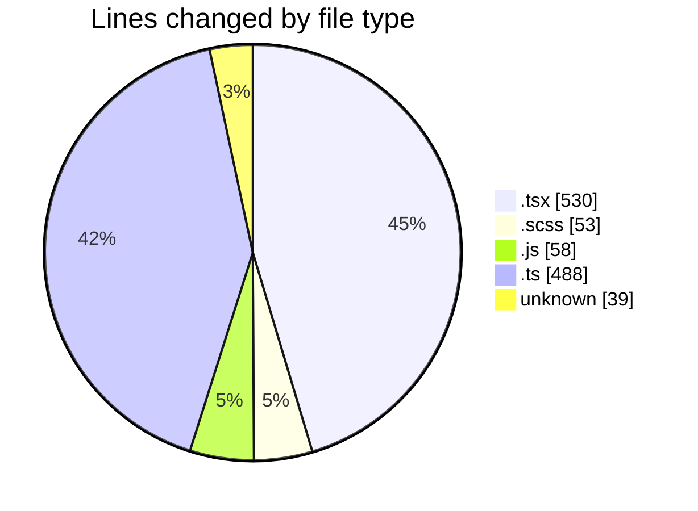
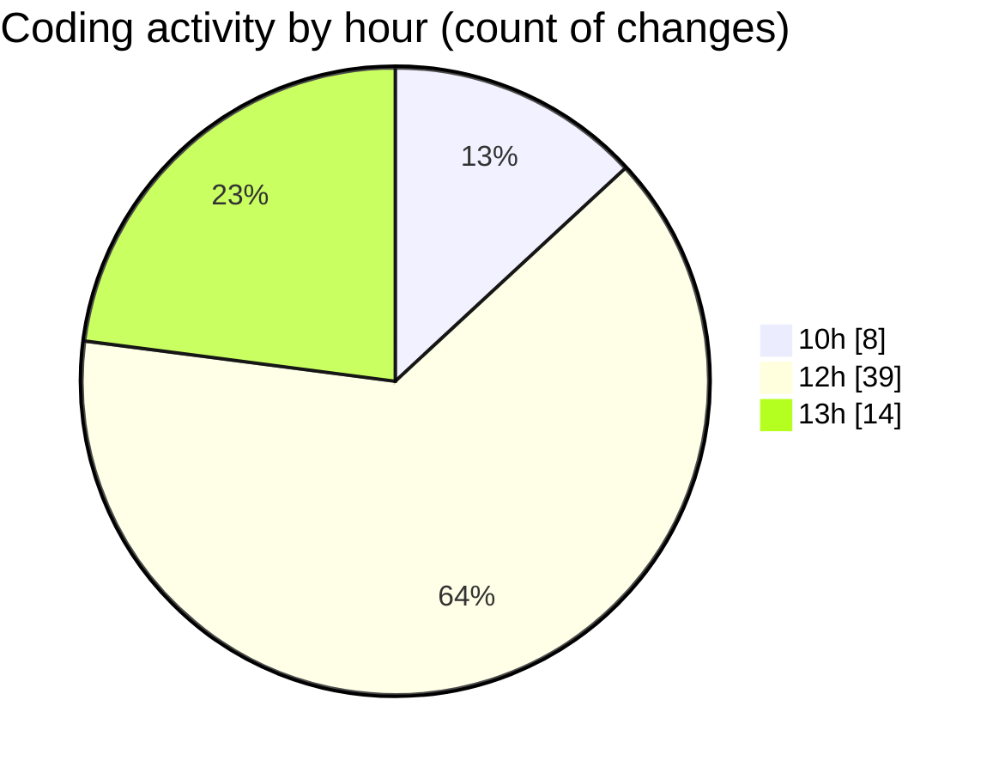

# cda - Activity Summary 

## Overall Statistics

| Stat                   | Value                                                             |
| ---------------------- | ----------------------------------------------------------------- |
| **Lines Added** (➕)   | 744                                          |
| **Lines Removed** (➖) | 424                                        |
| **Net Change** (↕)    | 320                |
| **Active Time** (⌚)   | 91 minutes |

## Modified Files
- **App.tsx** (+61, -3)
- **Admin.tsx** (+245, -221)
- **UserView.scss** (+18, -6)
- **index.js** (+58, -0)
- **summaryStats.ts** (+299, -189)
- **SummarySection.scss** (+24, -5)
- **.env** (+39, -0)

## Visualizations

### By File Type (Lines Changed)

### By Hour (Estimated Activity Count)

> **Last Updated:** 02/05/2025, 13:31:50