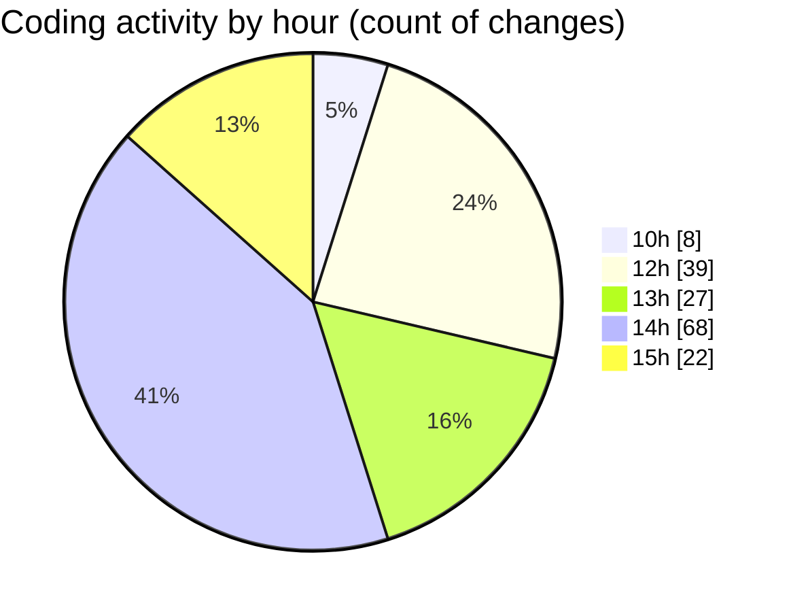

# cda - Activity Summary 

## Overall Statistics

| Stat                   | Value                                                             |
| ---------------------- | ----------------------------------------------------------------- |
| **Lines Added** (➕)   | 1733                                          |
| **Lines Removed** (➖) | 632                                        |
| **Net Change** (↕)    | 1101                |
| **Active Time** (⌚)   | 241 minutes |

## Modified Files
- **App.tsx** (+64, -9)
- **Admin.tsx** (+335, -311)
- **UserView.scss** (+18, -6)
- **index.js** (+58, -0)
- **summaryStats.ts** (+299, -189)
- **SummarySection.scss** (+24, -5)
- **.env** (+39, -0)
- **Home.tsx** (+96, -0)
- **Admin.scss** (+128, -94)
- **calculateSummaryData.test.ts** (+92, -1)
- **summaryStats.test.ts** (+183, -17)
- **settings.json** (+96, -0)
- **AdminView.tsx** (+186, -0)
- **AdminView.test.tsx** (+115, -0)

## Visualizations

### By File Type (Lines Changed)

### By Hour (Estimated Activity Count)

> **Last Updated:** 02/05/2025, 15:31:50