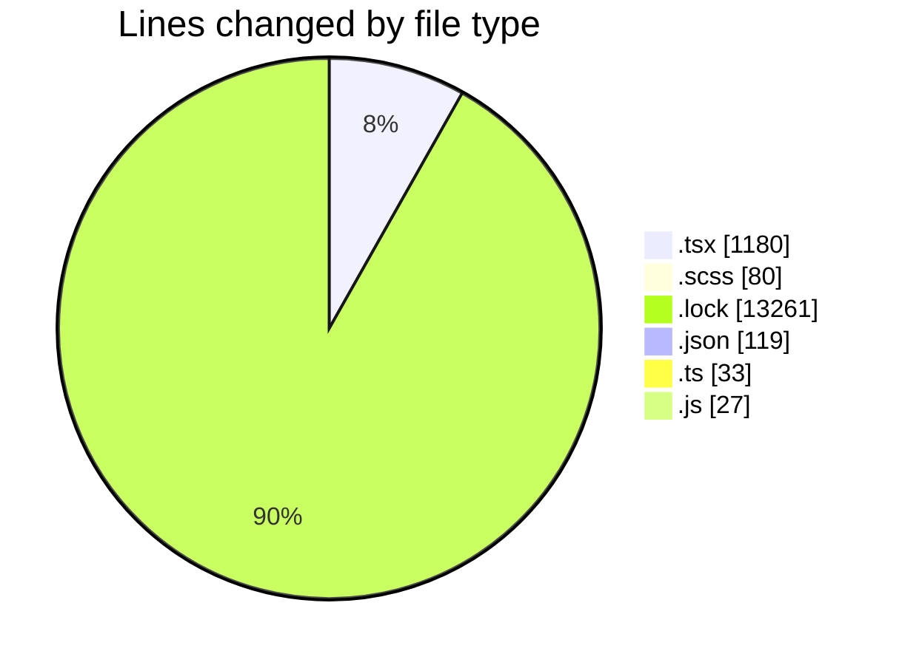
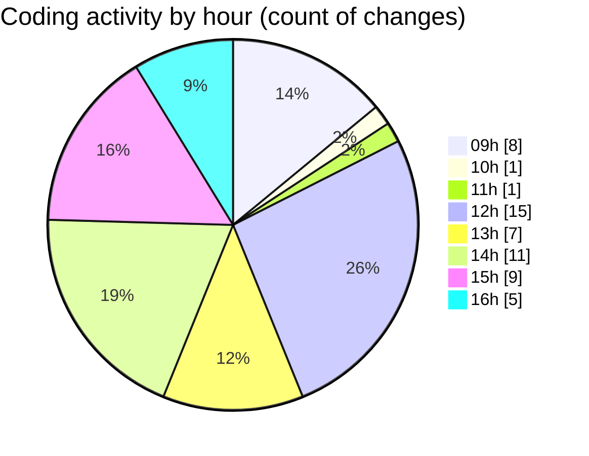

# cda - Activity Summary 

## Overall Statistics

| Stat                   | Value                                                             |
| ---------------------- | ----------------------------------------------------------------- |
| **Lines Added** (➕)   | 14582                                          |
| **Lines Removed** (➖) | 118                                        |
| **Net Change** (↕)    | 14464                |
| **Active Time** (⌚)   | 73 minutes |

## Modified Files
- **SummaryMetric.tsx** (+72, -17)
- **App.tsx** (+61, -3)
- **SummaryMetric.scss** (+76, -4)
- **yarn.lock** (+13197, -64)
- **package.json** (+80, -9)
- **App.tsx** (+234, -0)
- **ButtonNav.test.tsx** (+27, -5)
- **jest.config.ts** (+15, -0)
- **tsconfig.json** (+29, -1)
- **setupTests.ts** (+12, -6)
- **index.tsx** (+18, -0)
- **Duty.tsx** (+118, -0)
- **AllocateTestingHome.tsx** (+71, -0)
- **MonthlyViewRow.tsx** (+140, -0)
- **Home.tsx** (+414, -0)
- **jest.config.js** (+18, -9)

## Visualizations

### By File Type (Lines Changed)

### By Hour (Estimated Activity Count)

> **Last Updated:** 06/05/2025, 16:17:27