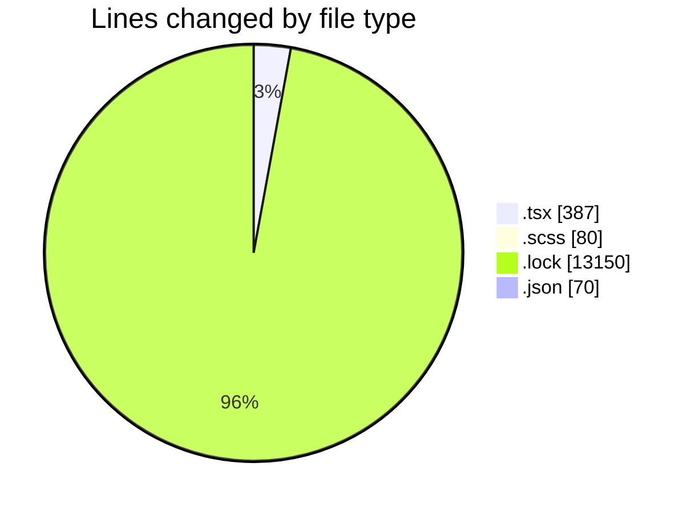
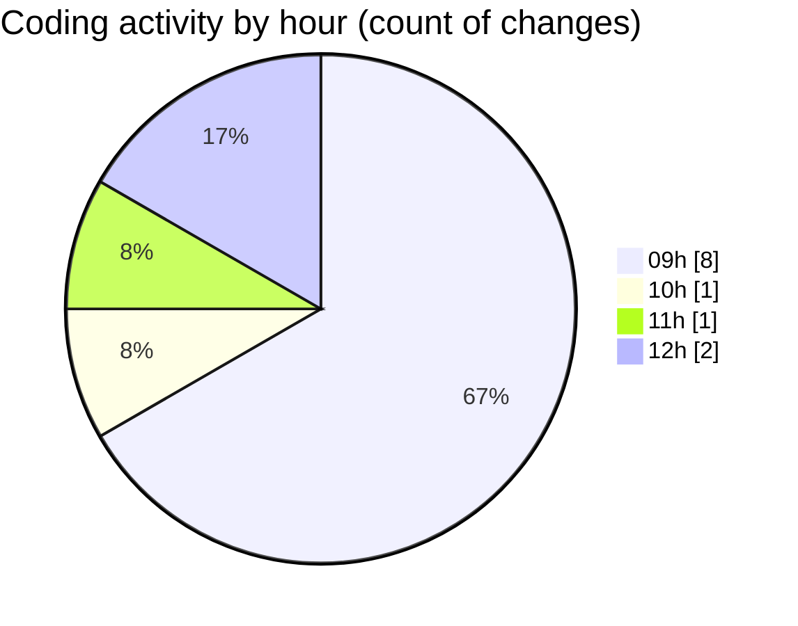

# cda - Activity Summary 

## Overall Statistics

| Stat                   | Value                                                             |
| ---------------------- | ----------------------------------------------------------------- |
| **Lines Added** (➕)   | 13663                                          |
| **Lines Removed** (➖) | 24                                        |
| **Net Change** (↕)    | 13639                |
| **Active Time** (⌚)   | 18 minutes |

## Modified Files
- **SummaryMetric.tsx** (+72, -17)
- **App.tsx** (+61, -3)
- **SummaryMetric.scss** (+76, -4)
- **yarn.lock** (+13150, -0)
- **package.json** (+70, -0)
- **App.tsx** (+234, -0)

## Visualizations

### By File Type (Lines Changed)

### By Hour (Estimated Activity Count)

> **Last Updated:** 06/05/2025, 12:02:27