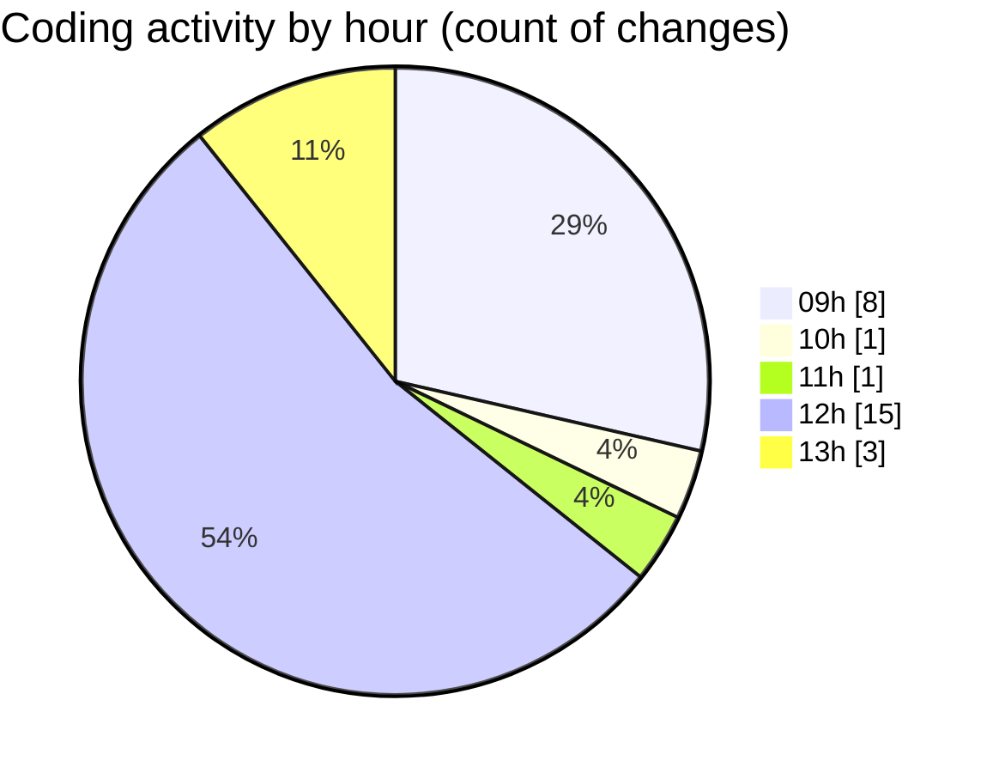

# cda - Activity Summary 

## Overall Statistics

| Stat                   | Value                                                             |
| ---------------------- | ----------------------------------------------------------------- |
| **Lines Added** (➕)   | 13752                                          |
| **Lines Removed** (➖) | 81                                        |
| **Net Change** (↕)    | 13671                |
| **Active Time** (⌚)   | 38 minutes |

## Modified Files
- **SummaryMetric.tsx** (+72, -17)
- **App.tsx** (+61, -3)
- **SummaryMetric.scss** (+76, -4)
- **yarn.lock** (+13172, -52)
- **package.json** (+71, -0)
- **App.tsx** (+234, -0)
- **ButtonNav.test.tsx** (+27, -5)
- **jest.config.ts** (+15, -0)
- **tsconfig.json** (+24, -0)

## Visualizations

### By File Type (Lines Changed)

### By Hour (Estimated Activity Count)

> **Last Updated:** 06/05/2025, 13:42:27