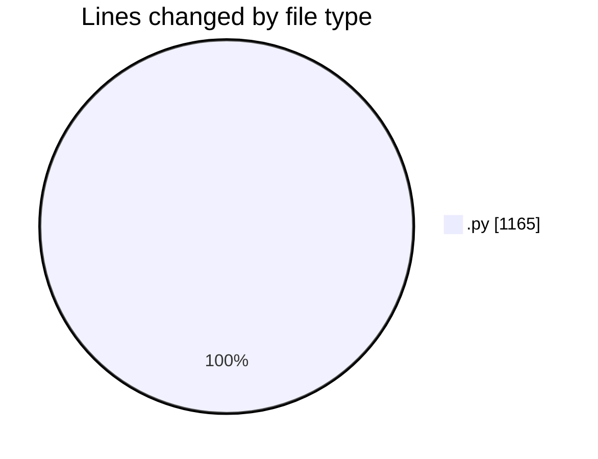
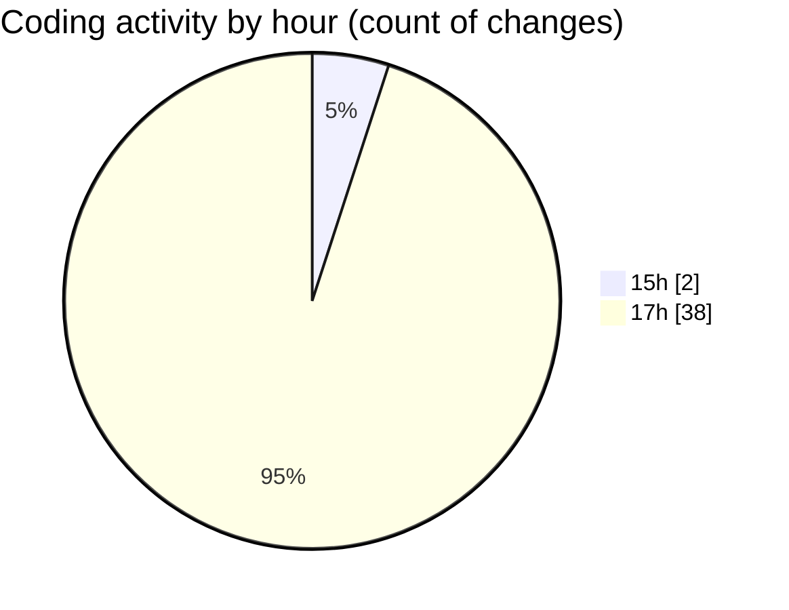

# samplePdf - Activity Summary 

## Overall Statistics

| Stat                   | Value                                                             |
| ---------------------- | ----------------------------------------------------------------- |
| **Lines Added** (➕)   | 1017                                          |
| **Lines Removed** (➖) | 148                                        |
| **Net Change** (↕)    | 869                |
| **Active Time** (⌚)   | 38 minutes |

## Modified Files
- **single.py** (+23, -0)
- **pdf_processing.py** (+59, -0)
- **file_upload.py** (+299, -0)
- **app.py** (+186, -102)
- **appPrint.py** (+16, -0)
- **database_module2.py** (+50, -0)
- **calcSiteTotals.py** (+58, -0)
- **calcGrandTotals.py** (+50, -2)
- **calculate_grand_totals.py** (+26, -0)
- **test_file_upload.py** (+34, -0)
- **test_integration.py** (+45, -0)
- **schema.py** (+171, -44)

## Visualizations

### By File Type (Lines Changed)

### By Hour (Estimated Activity Count)

> **Last Updated:** 06/05/2025, 17:50:28