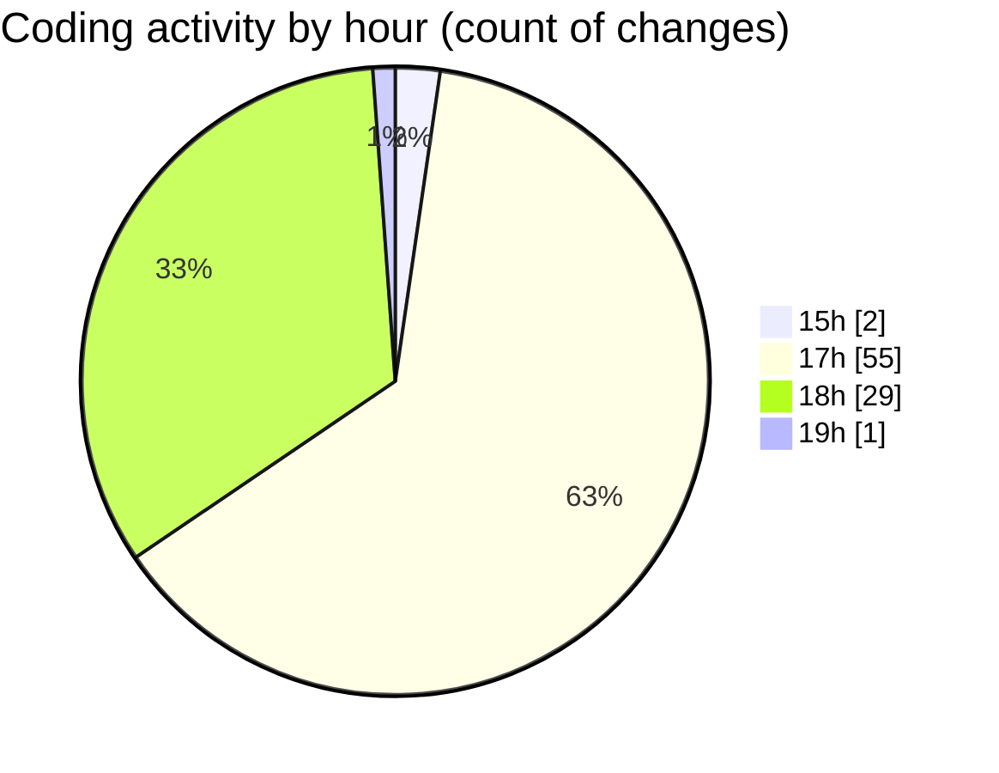

# samplePdf - Activity Summary 

## Overall Statistics

| Stat                   | Value                                                             |
| ---------------------- | ----------------------------------------------------------------- |
| **Lines Added** (➕)   | 2166                                          |
| **Lines Removed** (➖) | 399                                        |
| **Net Change** (↕)    | 1767                |
| **Active Time** (⌚)   | 106 minutes |

## Modified Files
- **single.py** (+23, -0)
- **pdf_processing.py** (+59, -0)
- **file_upload.py** (+321, -4)
- **app.py** (+186, -102)
- **appPrint.py** (+16, -0)
- **database_module2.py** (+50, -0)
- **calcSiteTotals.py** (+58, -0)
- **calcGrandTotals.py** (+50, -2)
- **calculate_grand_totals.py** (+26, -0)
- **test_file_upload.py** (+34, -0)
- **test_integration.py** (+45, -0)
- **schema.py** (+171, -44)
- **logger.py** (+22, -0)
- **app.log** (+108, -0)
- **apps.py** (+101, -0)
- **file_upload.py** (+321, -241)
- **extract_invoice_data.py** (+120, -0)
- **extract_text.py** (+54, -2)
- **processing_workflow.py** (+163, -1)
- **database_utils.py** (+91, -0)
- **extract_site_totals.py** (+75, -3)
- **__init__.py** (+5, -0)
- **pdf_parsers.py** (+67, -0)

## Visualizations

### By File Type (Lines Changed)

### By Hour (Estimated Activity Count)

> **Last Updated:** 06/05/2025, 19:00:28