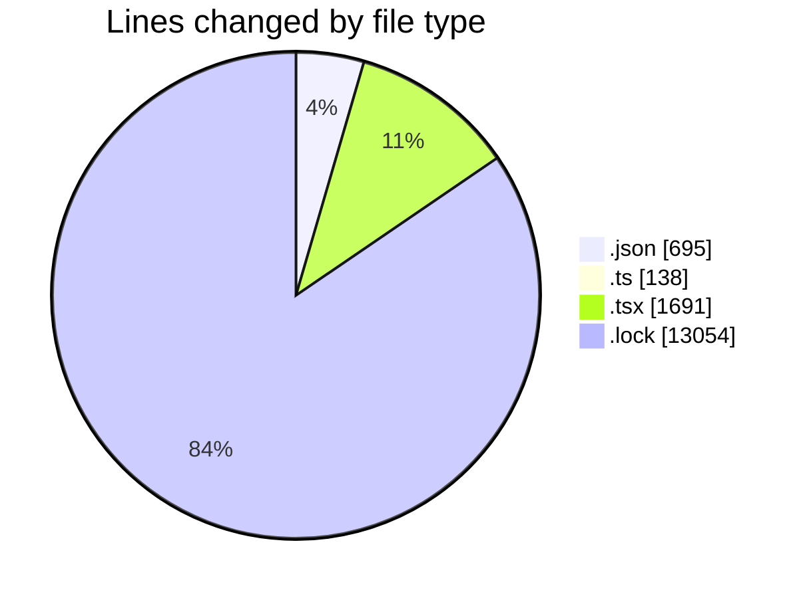
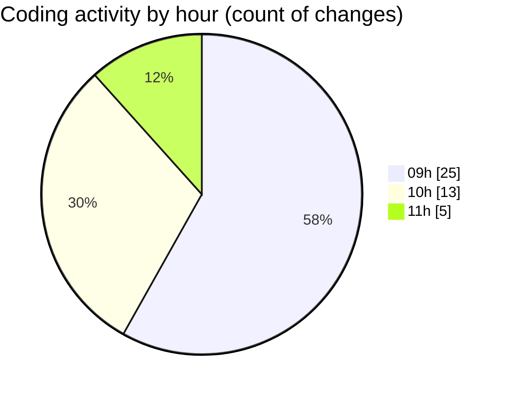

# cda - Activity Summary 

## Overall Statistics

| Stat                   | Value                                                             |
| ---------------------- | ----------------------------------------------------------------- |
| **Lines Added** (➕)   | 15556                                          |
| **Lines Removed** (➖) | 22                                        |
| **Net Change** (↕)    | 15534                |
| **Active Time** (⌚)   | 37 minutes |

## Modified Files
- **package.json** (+1, -1)
- **tsconfig.json** (+0, -4)
- **setupTests.ts** (+4, -0)
- **package.json** (+68, -1)
- **App.tsx** (+65, -0)
- **index.tsx** (+18, -0)
- **yarn.lock** (+13054, -0)
- **NewGroup.test.tsx** (+229, -0)
- **NewAlert.test.tsx** (+195, -0)
- **AlertEntry.tsx** (+41, -0)
- **Home.tsx** (+192, -0)
- **GroupList.tsx** (+82, -0)
- **GroupList.test.tsx** (+128, -0)
- **Alert.tsx** (+121, -0)
- **NewAlert.tsx** (+275, -15)
- **gql.ts** (+128, -0)
- **setupTests.ts** (+6, -0)
- **package.json** (+72, -0)
- **package.json** (+182, -0)
- **package.json** (+182, -0)
- **package.json** (+183, -1)
- **App.tsx** (+118, -0)
- **index.tsx** (+18, -0)
- **Search.tsx** (+76, -0)
- **Search.test.tsx** (+53, -0)
- **SearchResults.test.tsx** (+65, -0)

## Visualizations

### By File Type (Lines Changed)

### By Hour (Estimated Activity Count)

> **Last Updated:** 07/05/2025, 11:08:20