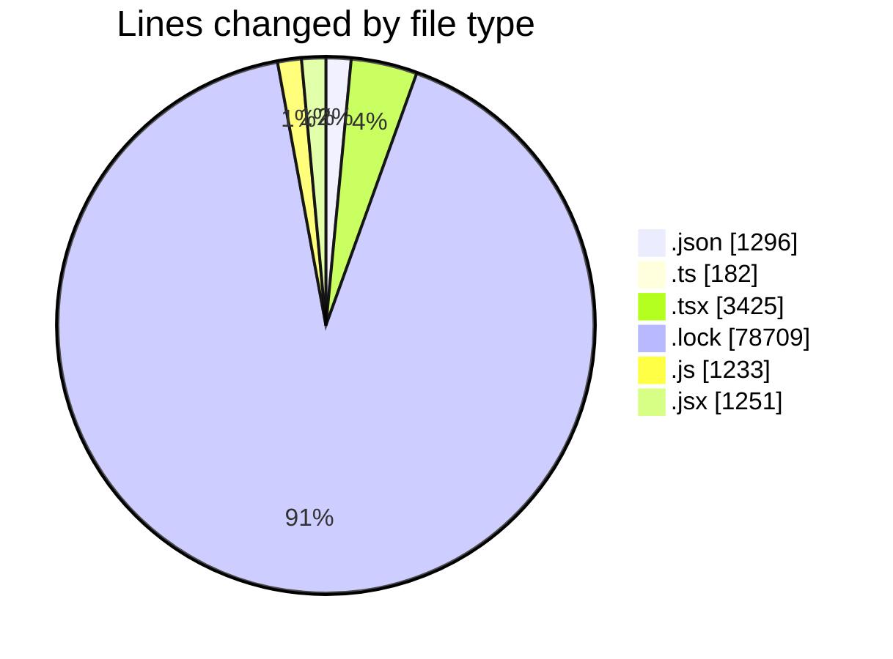
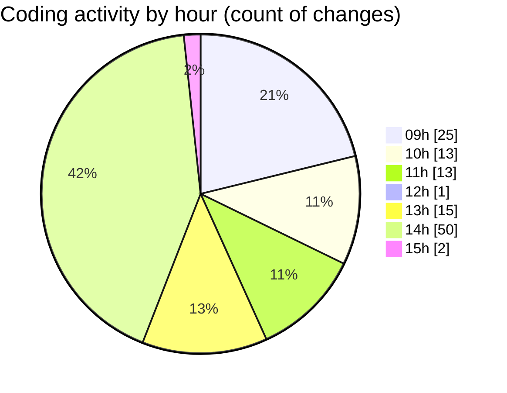

# cda - Activity Summary 

## Overall Statistics

| Stat                   | Value                                                             |
| ---------------------- | ----------------------------------------------------------------- |
| **Lines Added** (➕)   | 86031                                          |
| **Lines Removed** (➖) | 65                                        |
| **Net Change** (↕)    | 85966                |
| **Active Time** (⌚)   | 148 minutes |

## Modified Files
- **package.json** (+145, -3)
- **tsconfig.json** (+0, -4)
- **setupTests.ts** (+4, -0)
- **package.json** (+68, -1)
- **App.tsx** (+65, -0)
- **index.tsx** (+18, -0)
- **yarn.lock** (+13054, -0)
- **NewGroup.test.tsx** (+229, -0)
- **NewAlert.test.tsx** (+195, -0)
- **AlertEntry.tsx** (+41, -0)
- **Home.tsx** (+192, -0)
- **GroupList.tsx** (+82, -0)
- **GroupList.test.tsx** (+128, -0)
- **Alert.tsx** (+121, -0)
- **NewAlert.tsx** (+275, -15)
- **gql.ts** (+128, -0)
- **setupTests.ts** (+12, -0)
- **package.json** (+145, -0)
- **package.json** (+182, -0)
- **package.json** (+364, -0)
- **package.json** (+183, -1)
- **App.tsx** (+236, -0)
- **index.tsx** (+36, -0)
- **Search.tsx** (+152, -0)
- **Search.test.tsx** (+106, -0)
- **SearchResults.test.tsx** (+130, -0)
- **yarn.lock** (+26288, -7)
- **setupTests.ts** (+12, -0)
- **App.tsx** (+234, -0)
- **index.tsx** (+18, -0)
- **Duty.tsx** (+118, -0)
- **MonthlyViewRow.tsx** (+140, -0)
- **AllocateTestingHome.tsx** (+71, -0)
- **Home.tsx** (+414, -0)
- **package.json** (+64, -0)
- **App.tsx** (+58, -0)
- **setupTests.ts** (+6, -0)
- **RequestForm.test.tsx** (+163, -0)
- **yarn.lock** (+13143, -14)
- **package.json** (+74, -0)
- **setupTests.js** (+29, -0)
- **ITCRequestStatusSummary.jsx** (+95, -0)
- **index.js** (+35, -0)
- **index.js** (+225, -0)
- **MissingKit.jsx** (+62, -0)
- **KitMetaDataModal.jsx** (+141, -0)
- **ITCRequestsPanel.test.js** (+483, -0)
- **Search.test.jsx** (+241, -0)
- **TeamsTabs.test.jsx** (+260, -0)
- **FlatAssetList.jsx** (+152, -0)
- **ITCRequestsPanel.jsx** (+198, -0)
- **index.js** (+300, -0)
- **ITCRequestSummary.test.js** (+47, -0)
- **ITCRequestSummary.jsx** (+102, -0)
- **home.test.js** (+92, -0)
- **yarn.lock** (+13155, -0)
- **setupTests.js** (+20, -2)
- **App.tsx** (+81, -1)
- **package.json** (+62, -0)
- **setupTests.ts** (+5, -1)
- **yarn.lock** (+13034, -14)
- **setupTests.ts** (+14, -0)
- **SelectApp.test.tsx** (+104, -2)

## Visualizations

### By File Type (Lines Changed)

### By Hour (Estimated Activity Count)

> **Last Updated:** 07/05/2025, 15:01:48