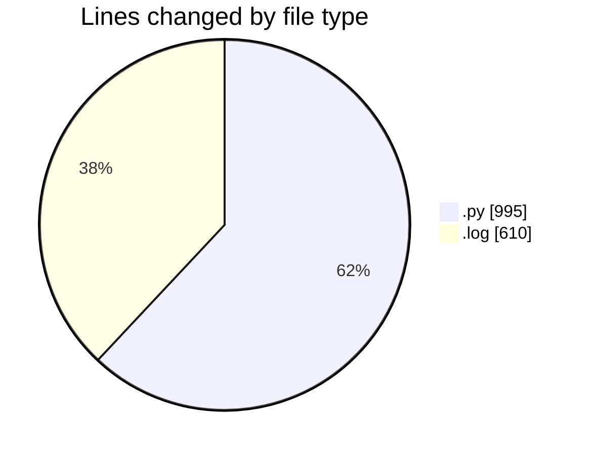
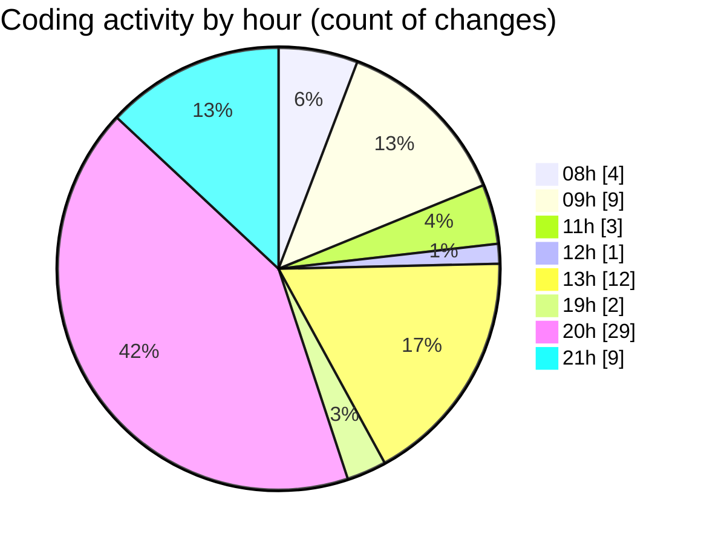

# samplePdf - Activity Summary 

## Overall Statistics

| Stat                   | Value                                                             |
| ---------------------- | ----------------------------------------------------------------- |
| **Lines Added** (➕)   | 1401                                          |
| **Lines Removed** (➖) | 204                                        |
| **Net Change** (↕)    | 1197                |
| **Active Time** (⌚)   | 78 minutes |

## Modified Files
- **extractSiteNames.py** (+97, -18)
- **file_upload.py** (+4, -4)
- **schema.py** (+83, -0)
- **app.py** (+6, -6)
- **app.log** (+610, -0)
- **pdf_parsers.py** (+78, -12)
- **schema.py** (+15, -6)
- **processing_workflow.py** (+269, -68)
- **extract_site_totals.py** (+75, -1)
- **extract_invoice_data.py** (+164, -89)

## Visualizations

### By File Type (Lines Changed)

### By Hour (Estimated Activity Count)

> **Last Updated:** 07/05/2025, 21:36:55