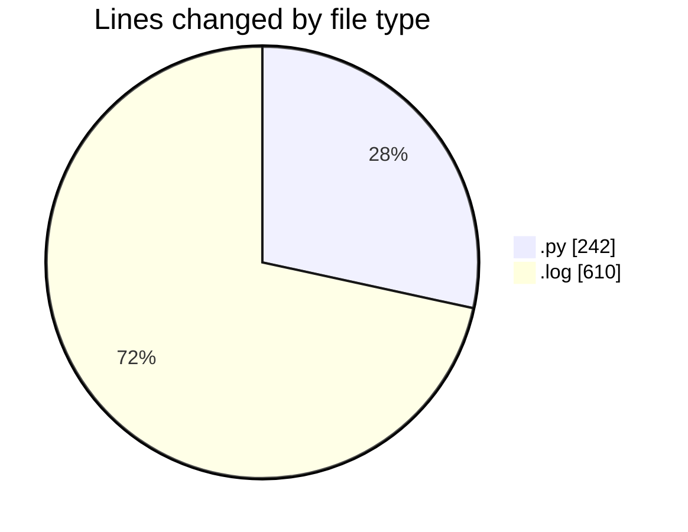
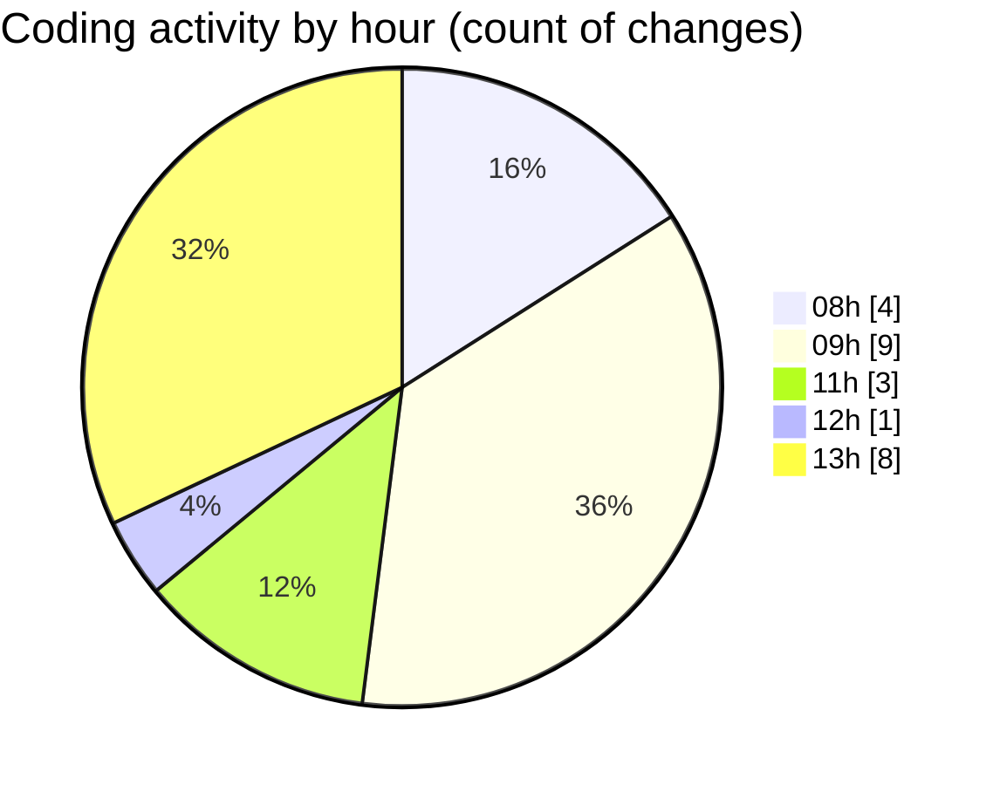

# samplePdf - Activity Summary 

## Overall Statistics

| Stat                   | Value                                                             |
| ---------------------- | ----------------------------------------------------------------- |
| **Lines Added** (➕)   | 817                                          |
| **Lines Removed** (➖) | 35                                        |
| **Net Change** (↕)    | 782                |
| **Active Time** (⌚)   | 26 minutes |

## Modified Files
- **extractSiteNames.py** (+97, -18)
- **file_upload.py** (+4, -4)
- **schema.py** (+83, -0)
- **app.py** (+6, -6)
- **app.log** (+610, -0)
- **pdf_parsers.py** (+2, -1)
- **schema.py** (+15, -6)

## Visualizations

### By File Type (Lines Changed)

### By Hour (Estimated Activity Count)

> **Last Updated:** 07/05/2025, 13:15:29