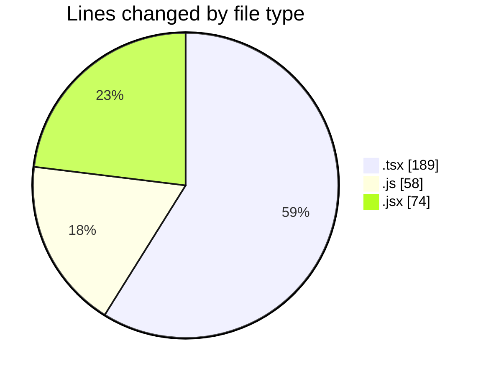

# cda - Activity Summary 

## Overall Statistics

| Stat                   | Value                                                             |
| ---------------------- | ----------------------------------------------------------------- |
| **Lines Added** (➕)   | 320                                          |
| **Lines Removed** (➖) | 1                                        |
| **Net Change** (↕)    | 319                |
| **Active Time** (⌚)   | 5 minutes |

## Modified Files
- **PoolPosition.test.tsx** (+189, -0)
- **MyFeedbackModal.test.js** (+58, -0)
- **MyFeedbackModel.jsx** (+73, -1)

## Visualizations

### By File Type (Lines Changed)

### By Hour (Estimated Activity Count)

> **Last Updated:** 08/05/2025, 09:40:48