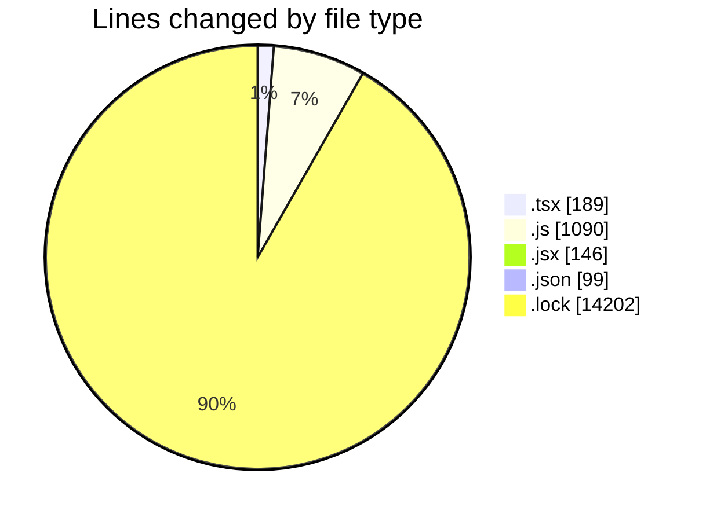
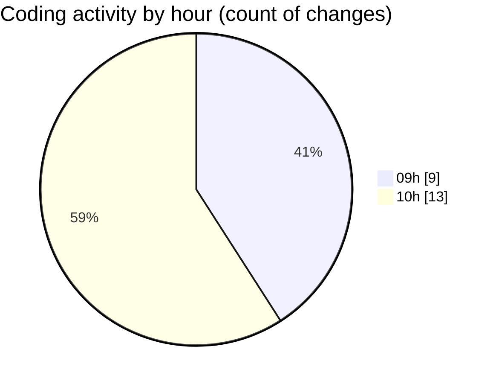

# cda - Activity Summary 

## Overall Statistics

| Stat                   | Value                                                             |
| ---------------------- | ----------------------------------------------------------------- |
| **Lines Added** (➕)   | 15702                                          |
| **Lines Removed** (➖) | 24                                        |
| **Net Change** (↕)    | 15678                |
| **Active Time** (⌚)   | 28 minutes |

## Modified Files
- **PoolPosition.test.tsx** (+189, -0)
- **MyFeedbackModal.test.js** (+70, -19)
- **MyFeedbackModel.jsx** (+73, -1)
- **index.js** (+3, -0)
- **package.json** (+96, -3)
- **MyFeedbackModal.jsx** (+72, -0)
- **MyProfile.test.js** (+391, -1)
- **yarn.lock** (+14202, -0)
- **MyFeedbackPanel.test.js** (+426, -0)
- **App.js** (+180, -0)

## Visualizations

### By File Type (Lines Changed)

### By Hour (Estimated Activity Count)

> **Last Updated:** 08/05/2025, 10:50:48