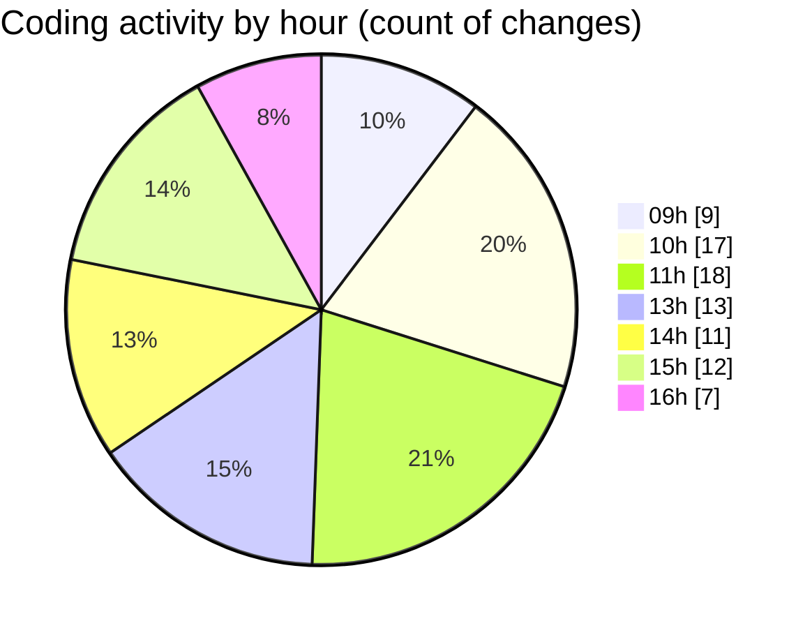

# cda - Activity Summary 

## Overall Statistics

| Stat                   | Value                                                             |
| ---------------------- | ----------------------------------------------------------------- |
| **Lines Added** (➕)   | 16850                                          |
| **Lines Removed** (➖) | 114                                        |
| **Net Change** (↕)    | 16736                |
| **Active Time** (⌚)   | 140 minutes |

## Modified Files
- **PoolPosition.test.tsx** (+189, -0)
- **MyFeedbackModal.test.js** (+70, -21)
- **MyFeedbackModel.jsx** (+73, -1)
- **index.js** (+3, -0)
- **package.json** (+102, -12)
- **MyFeedbackModal.jsx** (+72, -0)
- **MyProfile.test.js** (+391, -2)
- **yarn.lock** (+14207, -0)
- **MyFeedbackPanel.test.js** (+426, -0)
- **App.js** (+180, -0)
- **config.ts** (+111, -0)
- **RequestEditModal.test.tsx** (+115, -0)
- **App.tsx** (+82, -24)
- **SummaryMetric.tsx** (+87, -32)
- **SummaryMetric.test.tsx** (+26, -14)
- **summaryStats.test.ts** (+166, -0)
- **PreferenceAboutMe.tsx** (+222, -5)
- **SummarySection.tsx** (+42, -1)
- **summaryStats.ts** (+135, -2)
- **Admin.tsx** (+151, -0)

## Visualizations

### By File Type (Lines Changed)

### By Hour (Estimated Activity Count)

> **Last Updated:** 08/05/2025, 16:35:49