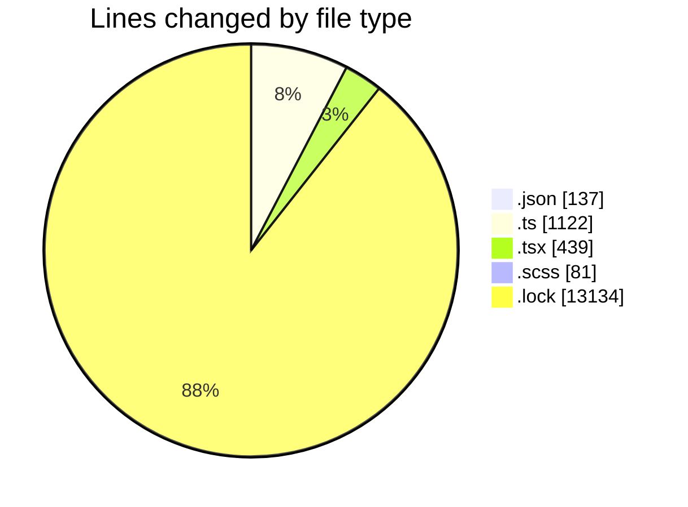
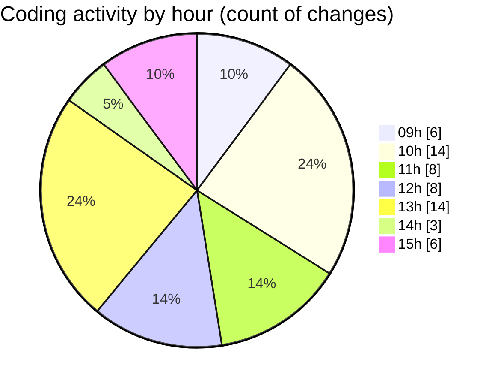

# cda - Activity Summary 

## Overall Statistics

| Stat                   | Value                                                             |
| ---------------------- | ----------------------------------------------------------------- |
| **Lines Added** (➕)   | 14808                                          |
| **Lines Removed** (➖) | 105                                        |
| **Net Change** (↕)    | 14703                |
| **Active Time** (⌚)   | 63 minutes |

## Modified Files
- **package.json** (+66, -0)
- **summaryStats.ts** (+292, -83)
- **App.tsx** (+122, -3)
- **summaryStats.test.ts** (+734, -13)
- **SummaryMetric.tsx** (+118, -4)
- **SummaryMetric.scss** (+79, -2)
- **SummarySection.tsx** (+41, -0)
- **Admin.tsx** (+151, -0)
- **package.json** (+71, -0)
- **yarn.lock** (+13134, -0)

## Visualizations

### By File Type (Lines Changed)

### By Hour (Estimated Activity Count)

> **Last Updated:** 09/05/2025, 15:40:27