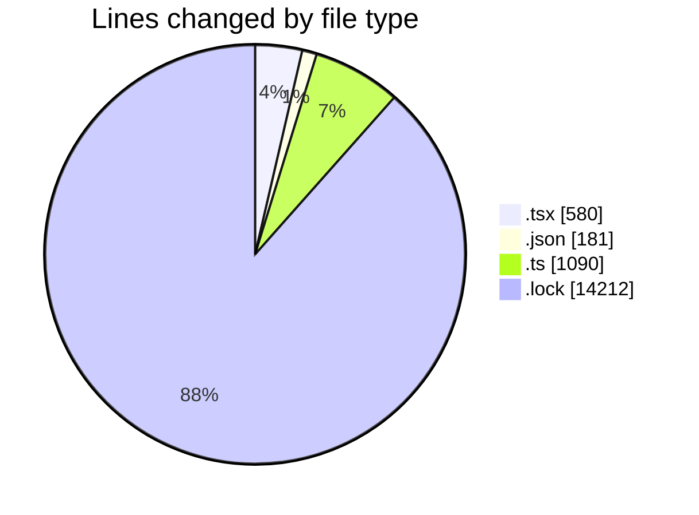
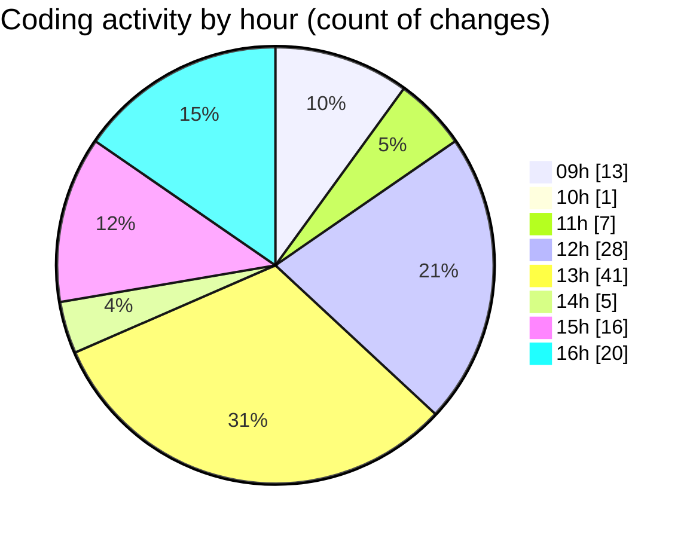

# cda - Activity Summary 

## Overall Statistics

| Stat                   | Value                                                             |
| ---------------------- | ----------------------------------------------------------------- |
| **Lines Added** (➕)   | 15693                                          |
| **Lines Removed** (➖) | 370                                        |
| **Net Change** (↕)    | 15323                |
| **Active Time** (⌚)   | 186 minutes |

## Modified Files
- **SummarySection.tsx** (+42, -0)
- **Admin.tsx** (+151, -52)
- **SummaryMetric.tsx** (+59, -0)
- **PreferenceAboutMe.tsx** (+212, -0)
- **package.json** (+0, -1)
- **package.json** (+0, -3)
- **package.json** (+0, -3)
- **package.json** (+0, -2)
- **package.json** (+71, -2)
- **summaryStats.test.ts** (+580, -147)
- **summaryStats.ts** (+217, -146)
- **App.tsx** (+61, -3)
- **package.json** (+96, -3)
- **yarn.lock** (+14204, -8)

## Visualizations

### By File Type (Lines Changed)

### By Hour (Estimated Activity Count)

> **Last Updated:** 12/05/2025, 16:22:28