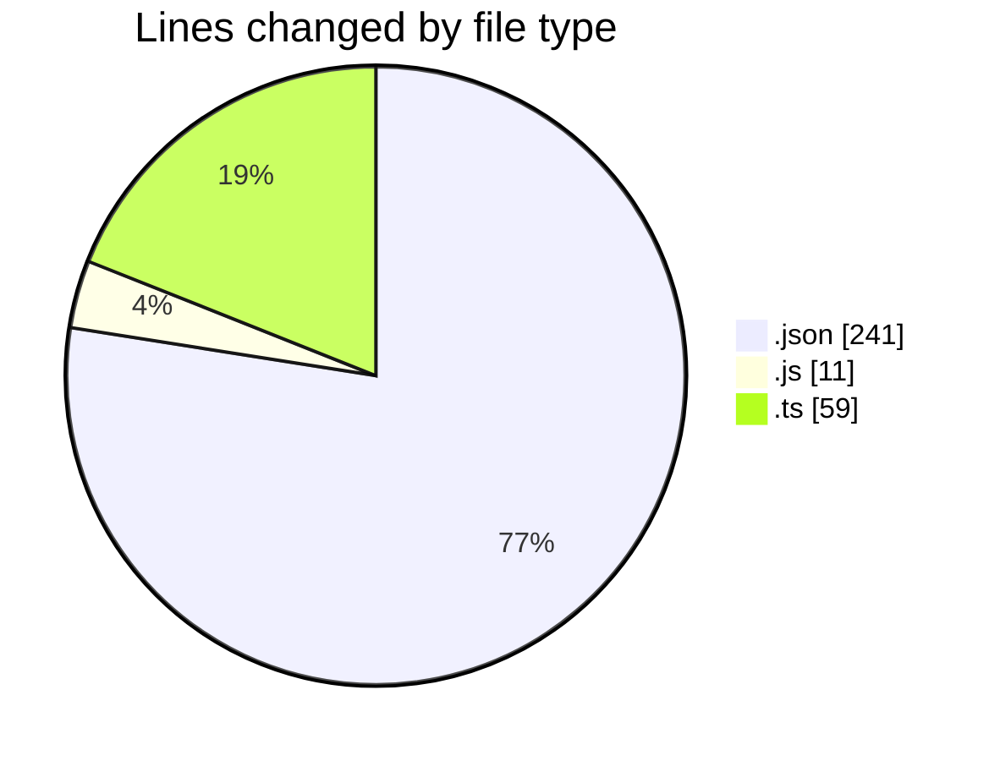

# news-clock-system-caspercg - Activity Summary 

## Overall Statistics

| Stat                   | Value                                                             |
| ---------------------- | ----------------------------------------------------------------- |
| **Lines Added** (➕)   | 202                                          |
| **Lines Removed** (➖) | 109                                        |
| **Net Change** (↕)    | 93                |
| **Active Time** (⌚)   | 26 minutes |

## Modified Files
- **package.json** (+21, -0)
- **tsconfig.json** (+117, -103)
- **clock-updater.js** (+11, -0)
- **clock-updater.ts** (+53, -6)

## Visualizations

### By File Type (Lines Changed)

### By Hour (Estimated Activity Count)

> **Last Updated:** 12/05/2025, 19:58:14