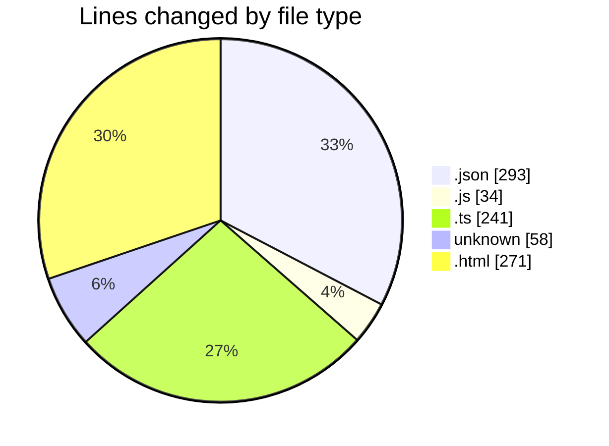
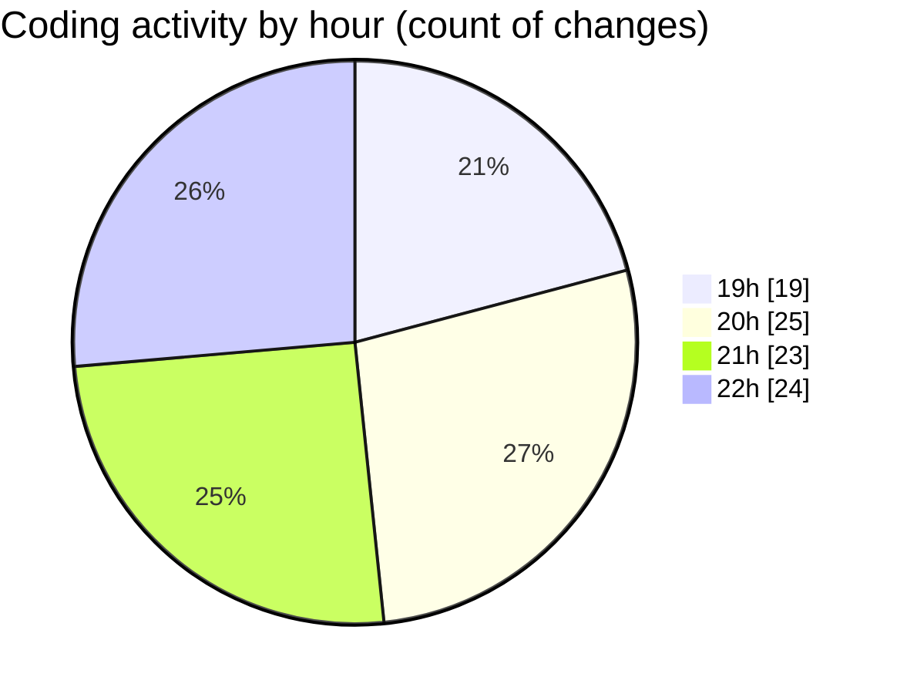

# news-clock-system-caspercg - Activity Summary 

## Overall Statistics

| Stat                   | Value                                                             |
| ---------------------- | ----------------------------------------------------------------- |
| **Lines Added** (➕)   | 641                                          |
| **Lines Removed** (➖) | 256                                        |
| **Net Change** (↕)    | 385                |
| **Active Time** (⌚)   | 141 minutes |

## Modified Files
- **package.json** (+28, -7)
- **tsconfig.json** (+129, -115)
- **clock-updater.js** (+11, -0)
- **clock-updater.ts** (+100, -86)
- **.gitignore** (+42, -16)
- **index.html** (+57, -2)
- **index.html** (+57, -2)
- **config.ts** (+4, -0)
- **ClockTicker.ts** (+25, -0)
- **CasparClient.ts** (+26, -0)
- **.eslintrc.json** (+14, -0)
- **eslint.config.js** (+23, -0)
- **MAIN.html** (+125, -28)

## Visualizations

### By File Type (Lines Changed)

### By Hour (Estimated Activity Count)

> **Last Updated:** 12/05/2025, 22:38:14