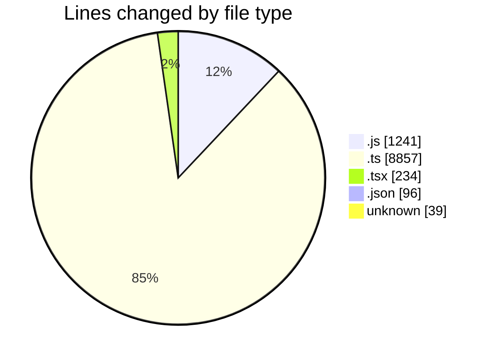
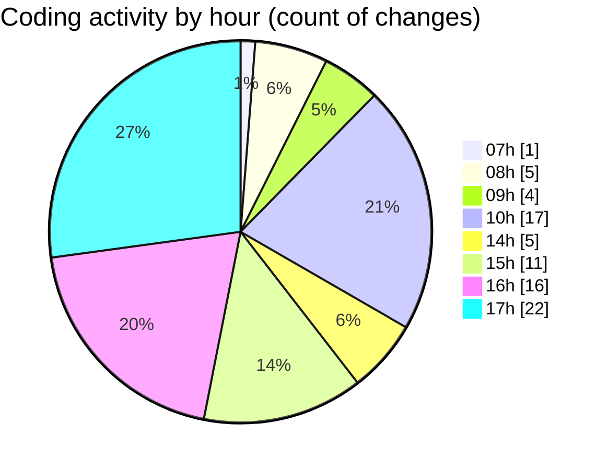

# cda - Activity Summary 

## Overall Statistics

| Stat                   | Value                                                             |
| ---------------------- | ----------------------------------------------------------------- |
| **Lines Added** (➕)   | 9796                                          |
| **Lines Removed** (➖) | 671                                        |
| **Net Change** (↕)    | 9125                |
| **Active Time** (⌚)   | 114 minutes |

## Modified Files
- **App.js** (+184, -0)
- **views.ts** (+27, -27)
- **profile-hub.ts** (+382, -327)
- **profile-hub.js** (+34, -26)
- **App.tsx** (+234, -0)
- **resolvers-types.ts** (+8094, -0)
- **settings.json** (+96, -0)
- **.env** (+39, -0)
- **20250514135407-create-profilehub-sub-skill-tag-to-person.js** (+23, -1)
- **subSkillTag-queries.js** (+251, -0)
- **subSkillTag-mutations.js** (+432, -290)

## Visualizations

### By File Type (Lines Changed)

### By Hour (Estimated Activity Count)

> **Last Updated:** 14/05/2025, 17:44:47