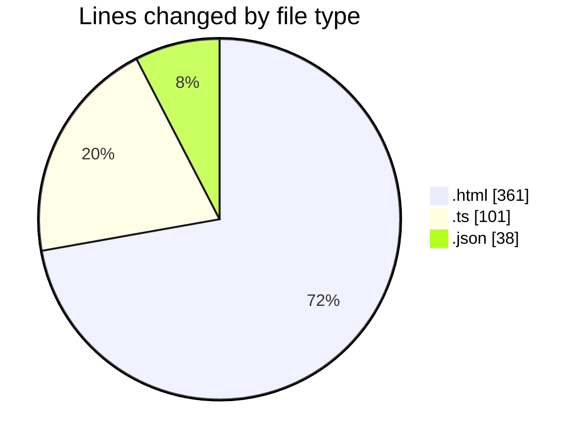
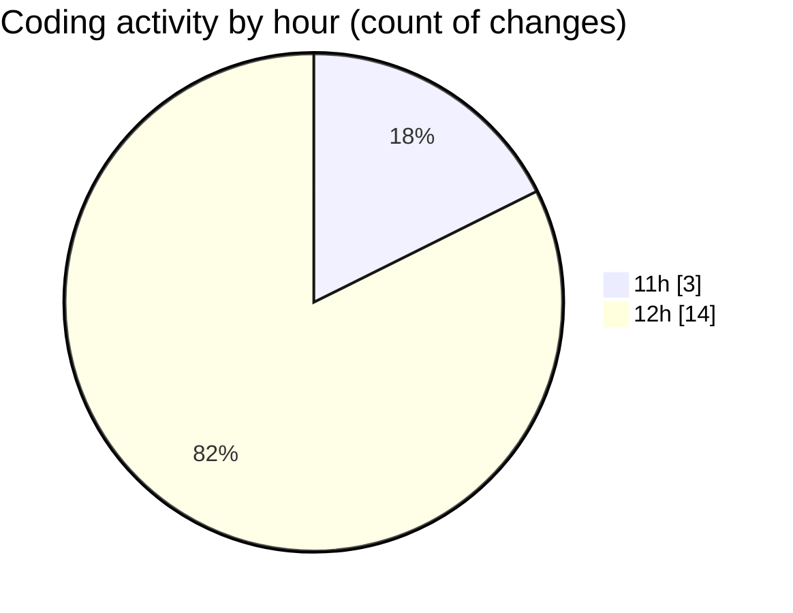

# news-clock-system-caspercg - Activity Summary 

## Overall Statistics

| Stat                   | Value                                                             |
| ---------------------- | ----------------------------------------------------------------- |
| **Lines Added** (➕)   | 458                                          |
| **Lines Removed** (➖) | 42                                        |
| **Net Change** (↕)    | 416                |
| **Active Time** (⌚)   | 19 minutes |

## Modified Files
- **wavybg.html** (+180, -41)
- **MAIN.html** (+140, -0)
- **CasparClient.test.ts** (+37, -0)
- **tsconfig.json** (+14, -0)
- **CasparClient.test.ts** (+38, -1)
- **package.json** (+24, -0)
- **ClockTicker.ts** (+25, -0)

## Visualizations

### By File Type (Lines Changed)

### By Hour (Estimated Activity Count)

> **Last Updated:** 15/05/2025, 13:01:12