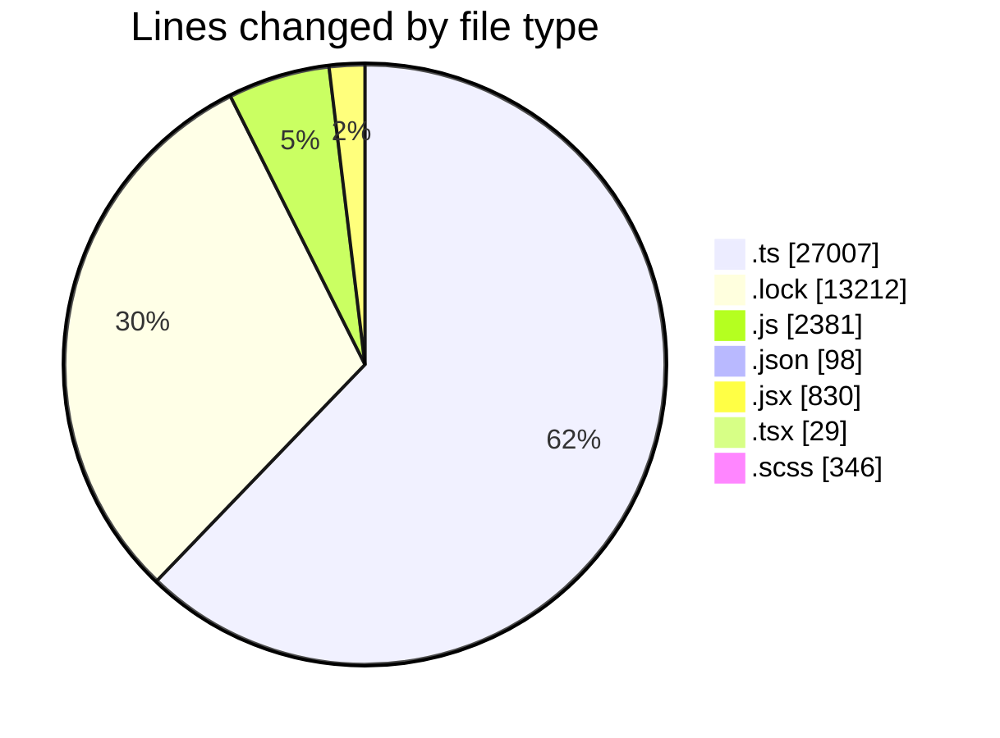
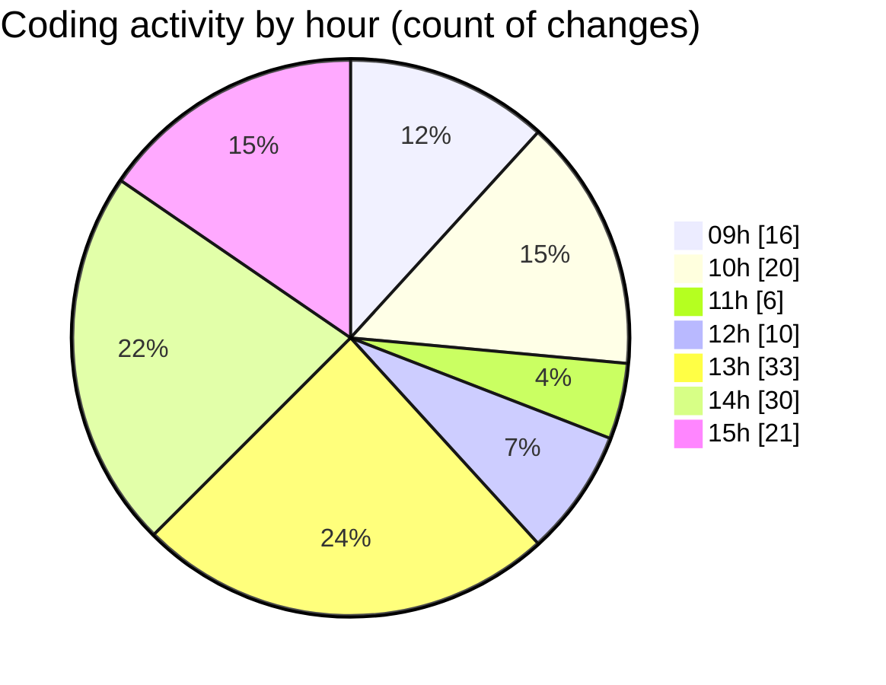

# cda - Activity Summary 

## Overall Statistics

| Stat                   | Value                                                             |
| ---------------------- | ----------------------------------------------------------------- |
| **Lines Added** (➕)   | 43242                                          |
| **Lines Removed** (➖) | 661                                        |
| **Net Change** (↕)    | 42581                |
| **Active Time** (⌚)   | 236 minutes |

## Modified Files
- **profile-hub.ts** (+2110, -280)
- **gql.ts** (+130, -0)
- **graphql.ts** (+6372, -0)
- **yarn.lock** (+13212, -0)
- **graphql.ts** (+4739, -0)
- **queries.ts** (+444, -0)
- **App.js** (+369, -5)
- **profile-hub.js** (+488, -69)
- **mutations.js** (+711, -157)
- **queries.js** (+557, -22)
- **settings.json** (+98, -0)
- **SkillTypeOverview.jsx** (+28, -0)
- **SkillOverview.jsx** (+54, -0)
- **SummaryBox.tsx** (+29, -0)
- **SkillOverview.scss** (+76, -1)
- **SkillExplore.jsx** (+62, -4)
- **SkillType.scss** (+30, -0)
- **SkillType.jsx** (+137, -0)
- **SkillTopic.jsx** (+334, -72)
- **views.ts** (+7829, -0)
- **tables.ts** (+5103, -0)
- **index.js** (+3, -0)
- **SubSkillOverview.jsx** (+96, -43)
- **SubSkillOverview.scss** (+80, -4)
- **SkillTopic.scss** (+151, -4)

## Visualizations

### By File Type (Lines Changed)

### By Hour (Estimated Activity Count)

> **Last Updated:** 16/05/2025, 15:23:33