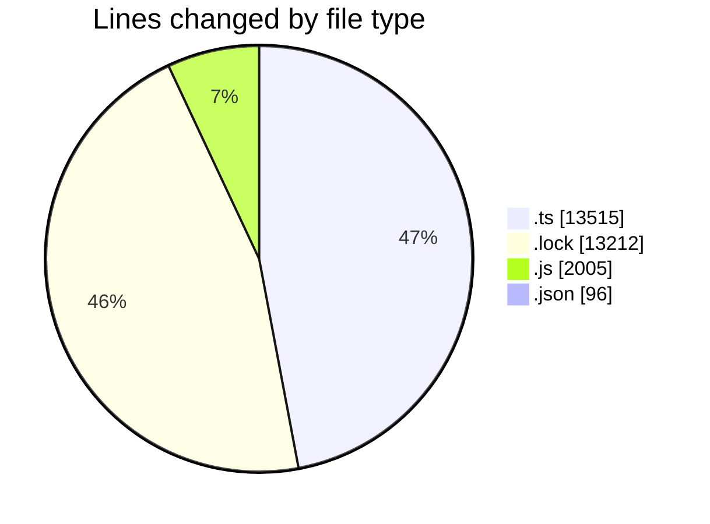
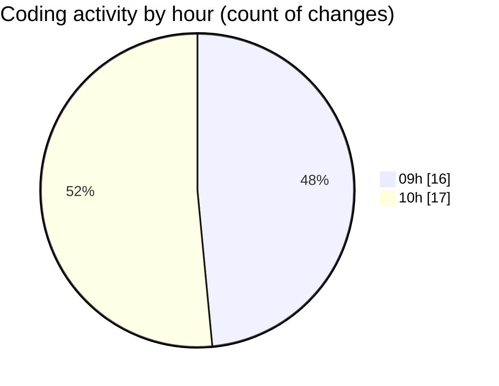

# cda - Activity Summary 

## Overall Statistics

| Stat                   | Value                                                             |
| ---------------------- | ----------------------------------------------------------------- |
| **Lines Added** (➕)   | 28743                                          |
| **Lines Removed** (➖) | 85                                        |
| **Net Change** (↕)    | 28658                |
| **Active Time** (⌚)   | 58 minutes |

## Modified Files
- **profile-hub.ts** (+1830, -0)
- **gql.ts** (+130, -0)
- **graphql.ts** (+6372, -0)
- **yarn.lock** (+13212, -0)
- **graphql.ts** (+4739, -0)
- **queries.ts** (+444, -0)
- **App.js** (+364, -0)
- **profile-hub.js** (+418, -34)
- **mutations.js** (+603, -51)
- **queries.js** (+535, -0)
- **settings.json** (+96, -0)

## Visualizations

### By File Type (Lines Changed)

### By Hour (Estimated Activity Count)

> **Last Updated:** 16/05/2025, 10:43:32