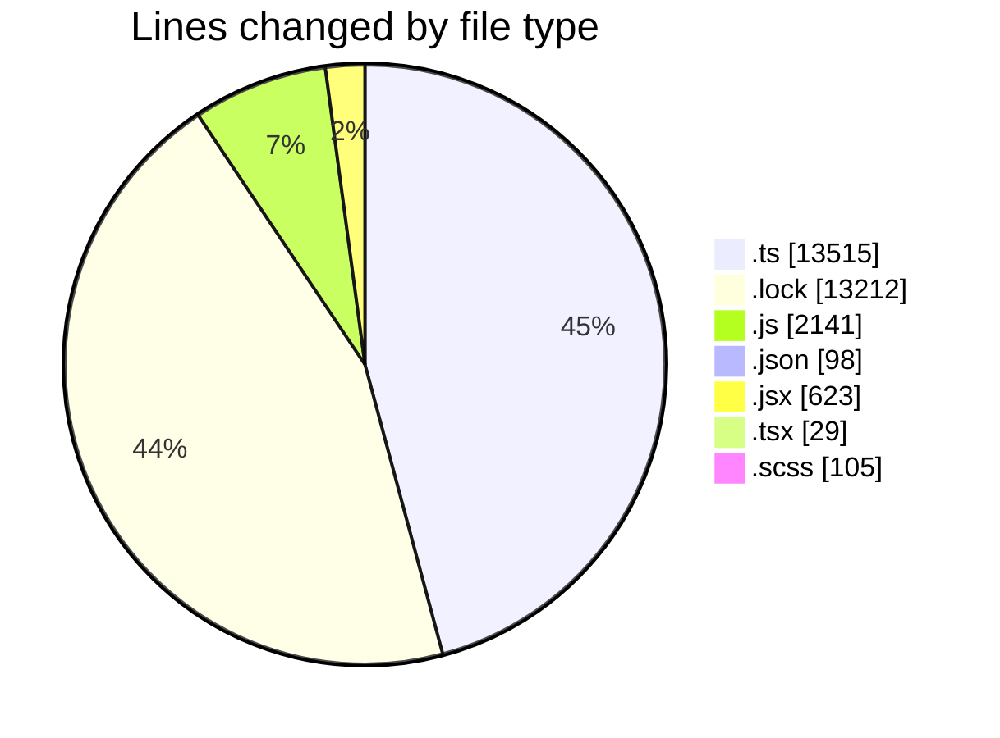
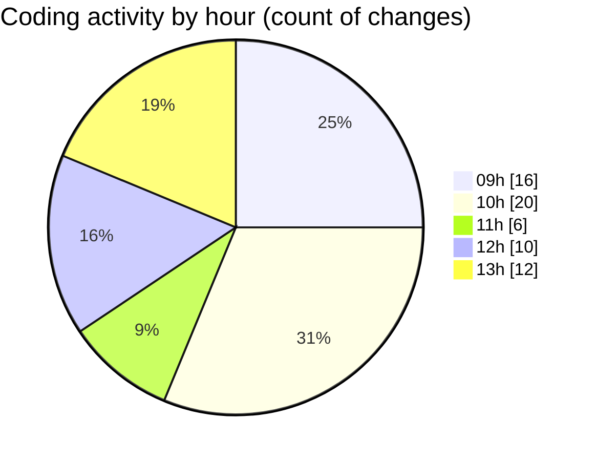

# cda - Activity Summary 

## Overall Statistics

| Stat                   | Value                                                             |
| ---------------------- | ----------------------------------------------------------------- |
| **Lines Added** (➕)   | 29478                                          |
| **Lines Removed** (➖) | 245                                        |
| **Net Change** (↕)    | 29233                |
| **Active Time** (⌚)   | 112 minutes |

## Modified Files
- **profile-hub.ts** (+1830, -0)
- **gql.ts** (+130, -0)
- **graphql.ts** (+6372, -0)
- **yarn.lock** (+13212, -0)
- **graphql.ts** (+4739, -0)
- **queries.ts** (+444, -0)
- **App.js** (+368, -4)
- **profile-hub.js** (+418, -34)
- **mutations.js** (+637, -123)
- **queries.js** (+535, -22)
- **settings.json** (+98, -0)
- **SkillTypeOverview.jsx** (+28, -0)
- **SkillOverview.jsx** (+54, -0)
- **SummaryBox.tsx** (+29, -0)
- **SkillOverview.scss** (+75, -0)
- **SkillExplore.jsx** (+60, -2)
- **SkillType.scss** (+30, -0)
- **SkillType.jsx** (+137, -0)
- **SkillTopic.jsx** (+282, -60)

## Visualizations

### By File Type (Lines Changed)

### By Hour (Estimated Activity Count)

> **Last Updated:** 16/05/2025, 13:18:33