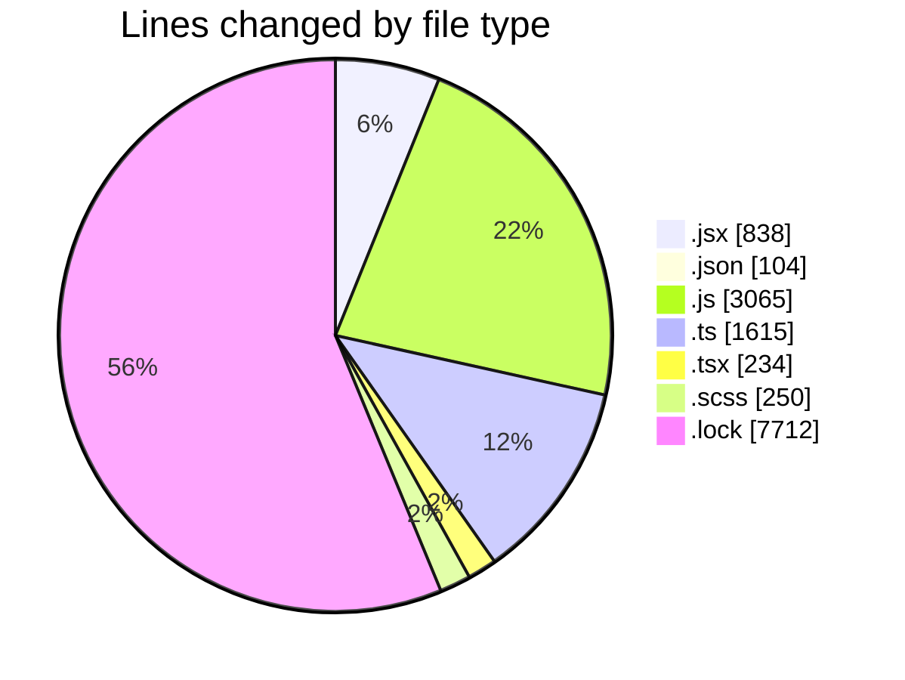
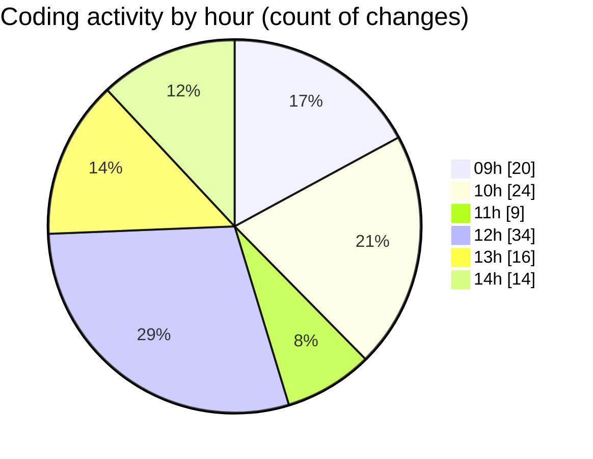

# cda - Activity Summary 

## Overall Statistics

| Stat                   | Value                                                             |
| ---------------------- | ----------------------------------------------------------------- |
| **Lines Added** (➕)   | 12941                                          |
| **Lines Removed** (➖) | 877                                        |
| **Net Change** (↕)    | 12064                |
| **Active Time** (⌚)   | 153 minutes |

## Modified Files
- **SkillTopic.jsx** (+340, -71)
- **settings.json** (+100, -4)
- **SkillTopic.test.js** (+541, -336)
- **App.js** (+200, -10)
- **SubSkillOverview.jsx** (+58, -3)
- **SubSkillTopic.jsx** (+263, -30)
- **mutations.js** (+685, -89)
- **profile-hub.ts** (+1335, -280)
- **SubSkillOverview.test.jsx** (+69, -4)
- **SubSkillTopic.test.js** (+194, -41)
- **queries.js** (+550, -0)
- **profile-hub.js** (+419, -0)
- **App.tsx** (+234, -0)
- **SubSkillTopic.scss** (+161, -5)
- **SubSkillOverview.scss** (+80, -4)
- **yarn.lock** (+7712, -0)

## Visualizations

### By File Type (Lines Changed)

### By Hour (Estimated Activity Count)

> **Last Updated:** 19/05/2025, 14:11:13