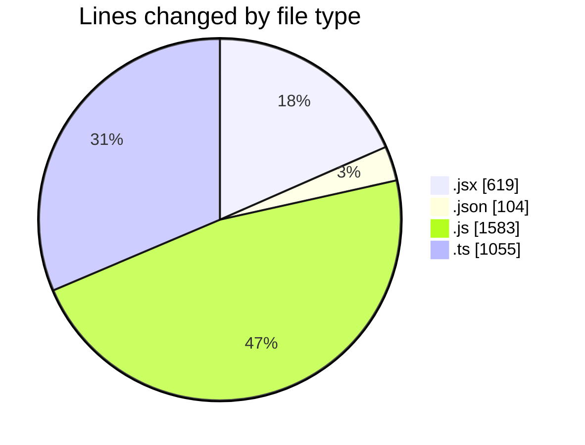
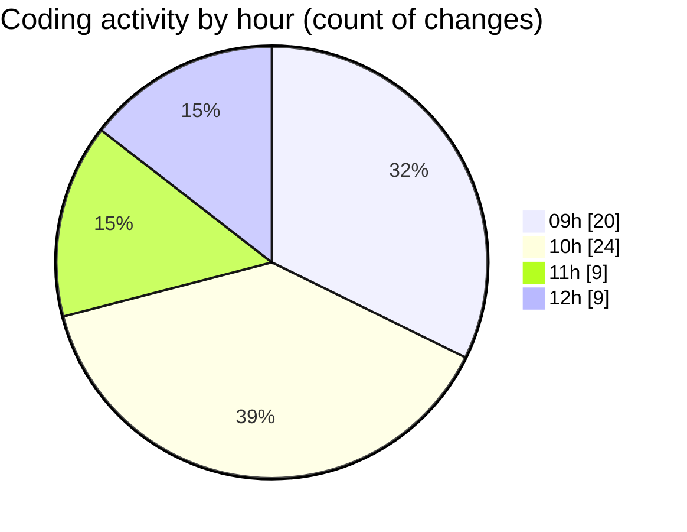

# cda - Activity Summary 

## Overall Statistics

| Stat                   | Value                                                             |
| ---------------------- | ----------------------------------------------------------------- |
| **Lines Added** (➕)   | 3029                                          |
| **Lines Removed** (➖) | 332                                        |
| **Net Change** (↕)    | 2697                |
| **Active Time** (⌚)   | 94 minutes |

## Modified Files
- **SkillTopic.jsx** (+293, -24)
- **settings.json** (+100, -4)
- **SkillTopic.test.js** (+494, -289)
- **App.js** (+190, -0)
- **SubSkillOverview.jsx** (+58, -3)
- **SubSkillTopic.jsx** (+167, -1)
- **mutations.js** (+603, -7)
- **profile-hub.ts** (+1055, -0)
- **SubSkillOverview.test.jsx** (+69, -4)

## Visualizations

### By File Type (Lines Changed)

### By Hour (Estimated Activity Count)

> **Last Updated:** 19/05/2025, 12:31:13