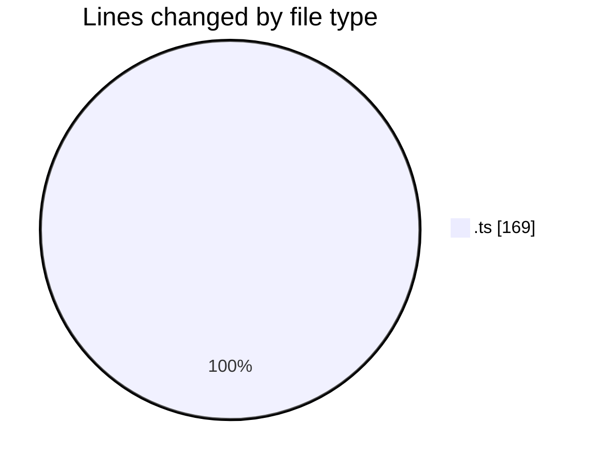
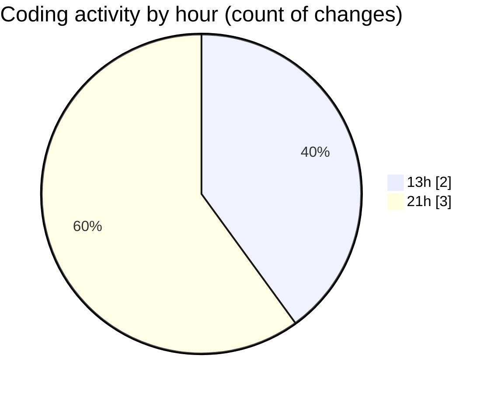

# news-clock-system-caspercg - Activity Summary 

## Overall Statistics

| Stat                   | Value                                                             |
| ---------------------- | ----------------------------------------------------------------- |
| **Lines Added** (➕)   | 101                                          |
| **Lines Removed** (➖) | 68                                        |
| **Net Change** (↕)    | 33                |
| **Active Time** (⌚)   | 4 minutes |

## Modified Files
- **amcp.ts** (+4, -0)
- **clock-updater.test.ts** (+97, -68)

## Visualizations

### By File Type (Lines Changed)

### By Hour (Estimated Activity Count)

> **Last Updated:** 19/05/2025, 21:04:01