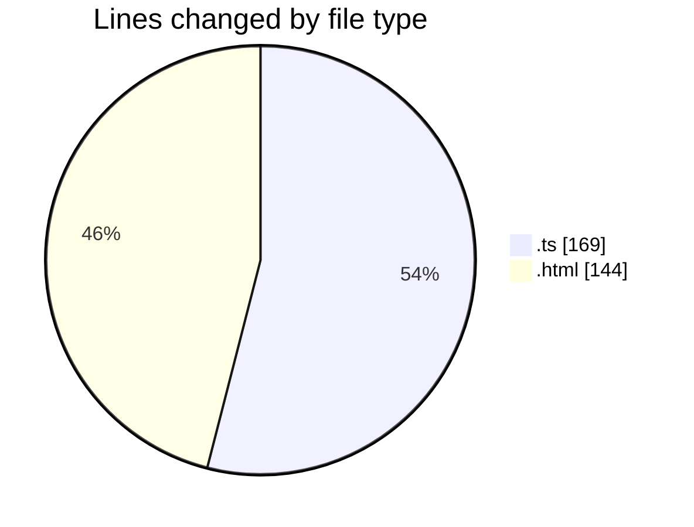
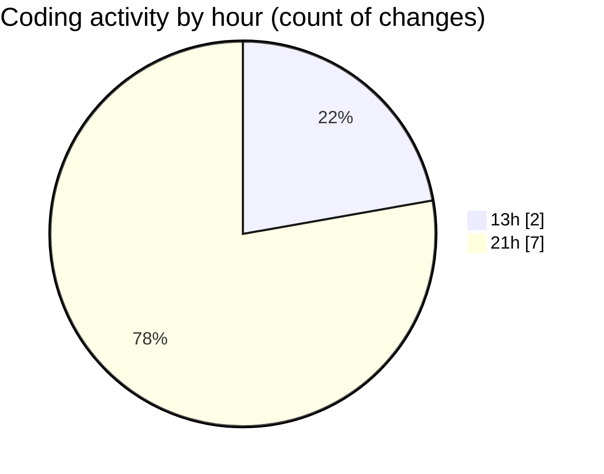

# news-clock-system-caspercg - Activity Summary 

## Overall Statistics

| Stat                   | Value                                                             |
| ---------------------- | ----------------------------------------------------------------- |
| **Lines Added** (➕)   | 242                                          |
| **Lines Removed** (➖) | 71                                        |
| **Net Change** (↕)    | 171                |
| **Active Time** (⌚)   | 9 minutes |

## Modified Files
- **amcp.ts** (+4, -0)
- **clock-updater.test.ts** (+97, -68)
- **MAIN.html** (+141, -3)

## Visualizations

### By File Type (Lines Changed)

### By Hour (Estimated Activity Count)

> **Last Updated:** 19/05/2025, 21:09:01