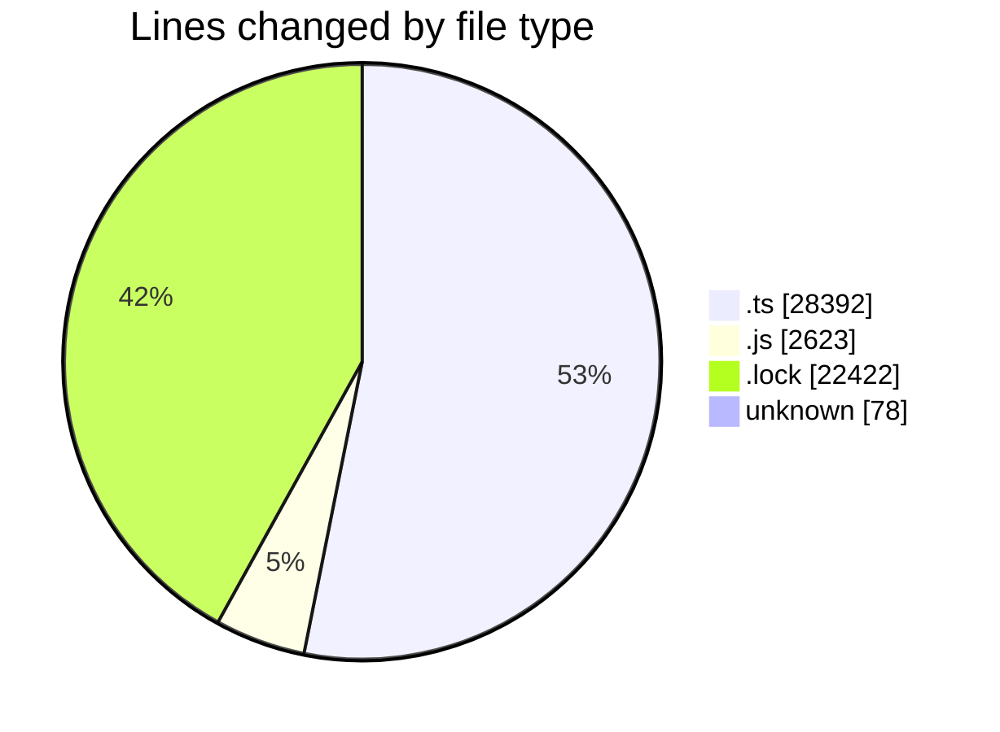
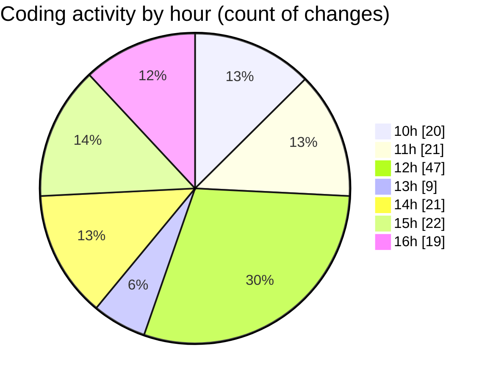

# cda - Activity Summary 

## Overall Statistics

| Stat                   | Value                                                             |
| ---------------------- | ----------------------------------------------------------------- |
| **Lines Added** (➕)   | 52167                                          |
| **Lines Removed** (➖) | 1348                                        |
| **Net Change** (↕)    | 50819                |
| **Active Time** (⌚)   | 251 minutes |

## Modified Files
- **everywher.test.ts** (+236, -2)
- **everywhere.ts** (+100, -8)
- **everywhere.ts** (+537, -104)
- **everywhere.js** (+110, -92)
- **everywhere.test.js** (+257, -117)
- **clear_view_views.ts** (+2892, -0)
- **sap_tables.ts** (+1709, -0)
- **yarn.lock** (+6998, -0)
- **everywhere.js** (+103, -17)
- **.env** (+78, -0)
- **index.js** (+70, -0)
- **resolvers-types.ts** (+10960, -0)
- **resolvers-types.ts** (+8179, -0)
- **yarn.lock** (+15424, -0)
- **sap_views.ts** (+1144, -0)
- **index.js** (+35, -0)
- **20250520125819-alter-everywhere-users-group-memeber.js** (+61, -48)
- **20250520134506-aler-everywhere-users-group-memeber.js** (+17, -0)
- **20250520134624-alter-everywhere-group-members.js** (+24, -0)
- **yesalert-mutations.js** (+836, -0)
- **everywhere-mutations.js** (+836, -0)
- **everywhere-mutations.ts** (+890, -583)
- **everywhere-queries.ts** (+671, -377)

## Visualizations

### By File Type (Lines Changed)

### By Hour (Estimated Activity Count)

> **Last Updated:** 20/05/2025, 17:00:33