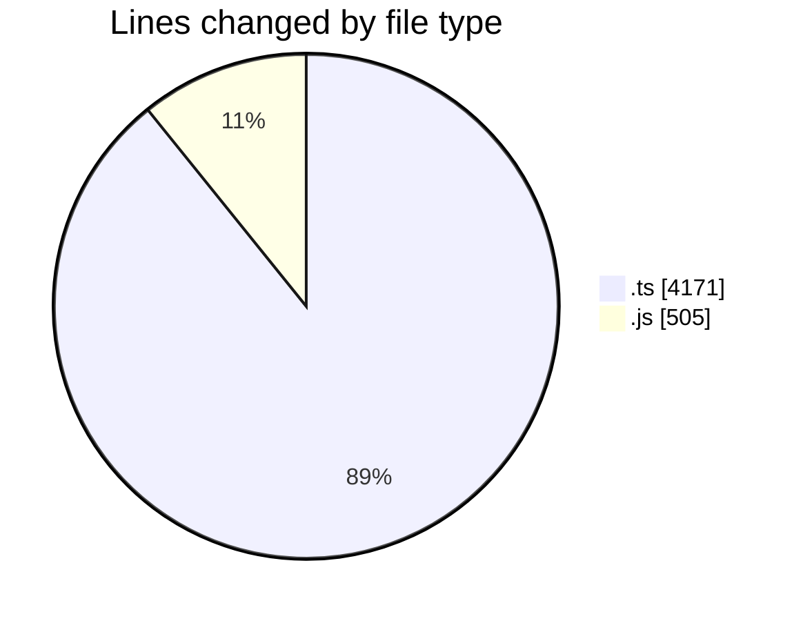
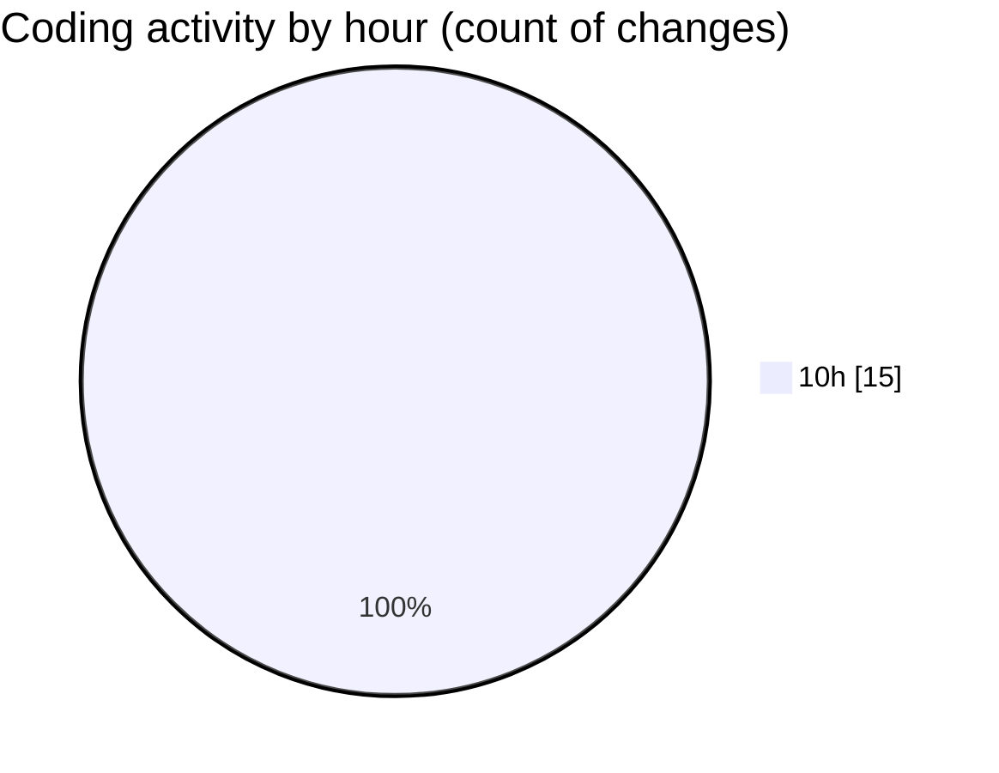

# cda - Activity Summary 

## Overall Statistics

| Stat                   | Value                                                             |
| ---------------------- | ----------------------------------------------------------------- |
| **Lines Added** (➕)   | 4466                                          |
| **Lines Removed** (➖) | 210                                        |
| **Net Change** (↕)    | 4256                |
| **Active Time** (⌚)   | 29 minutes |

## Modified Files
- **everywher.test.ts** (+109, -2)
- **everywhere.ts** (+98, -0)
- **everywhere.ts** (+233, -0)
- **everywhere.js** (+110, -91)
- **everywhere.test.js** (+187, -117)
- **clear_view_views.ts** (+2892, -0)
- **sap_tables.ts** (+837, -0)

## Visualizations

### By File Type (Lines Changed)

### By Hour (Estimated Activity Count)

> **Last Updated:** 20/05/2025, 10:32:16