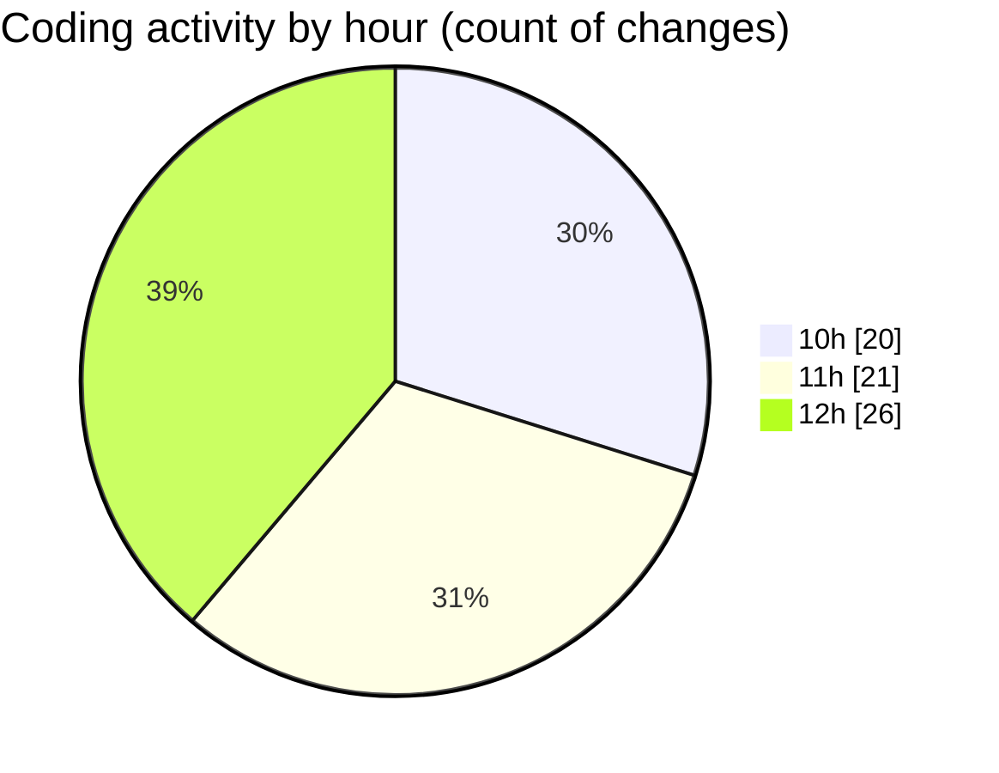

# cda - Activity Summary 

## Overall Statistics

| Stat                   | Value                                                             |
| ---------------------- | ----------------------------------------------------------------- |
| **Lines Added** (➕)   | 19108                                          |
| **Lines Removed** (➖) | 300                                        |
| **Net Change** (↕)    | 18808                |
| **Active Time** (⌚)   | 116 minutes |

## Modified Files
- **everywher.test.ts** (+109, -2)
- **everywhere.ts** (+100, -8)
- **everywhere.ts** (+267, -75)
- **everywhere.js** (+110, -92)
- **everywhere.test.js** (+187, -117)
- **clear_view_views.ts** (+2892, -0)
- **sap_tables.ts** (+837, -0)
- **yarn.lock** (+3499, -0)
- **everywhere.js** (+92, -6)
- **.env** (+39, -0)
- **index.js** (+35, -0)
- **resolvers-types.ts** (+10941, -0)

## Visualizations

### By File Type (Lines Changed)

### By Hour (Estimated Activity Count)

> **Last Updated:** 20/05/2025, 12:22:17