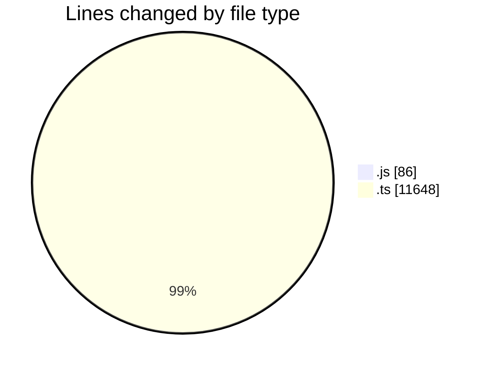
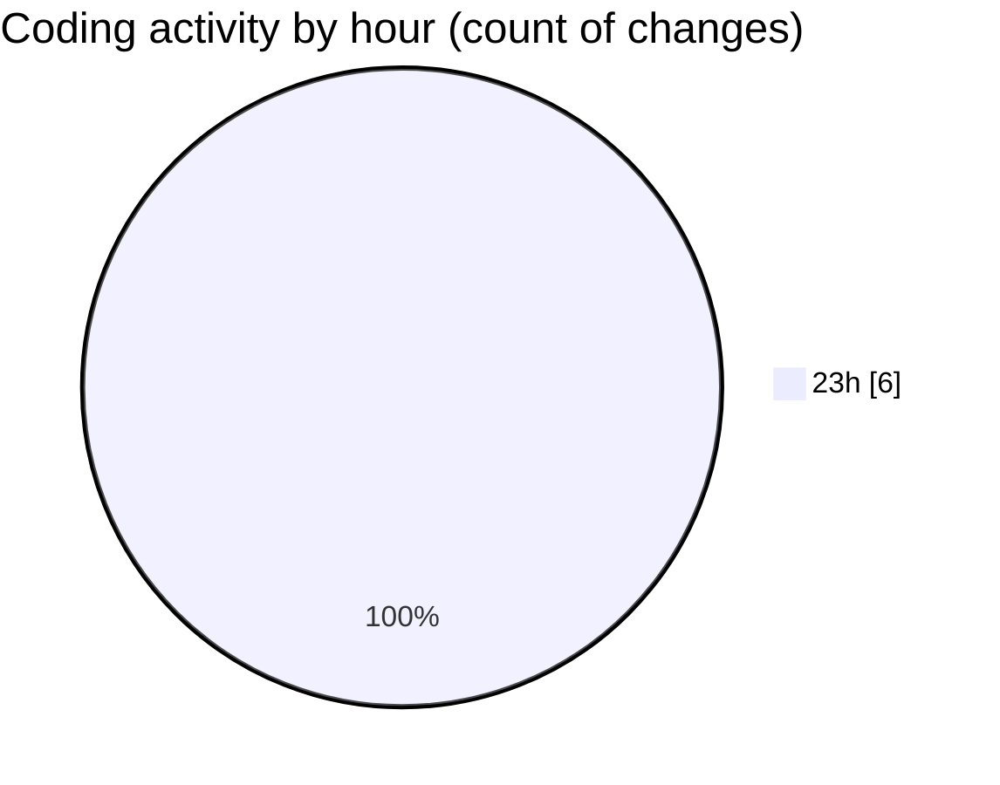

# cda - Activity Summary 

## Overall Statistics

| Stat                   | Value                                                             |
| ---------------------- | ----------------------------------------------------------------- |
| **Lines Added** (➕)   | 11730                                          |
| **Lines Removed** (➖) | 4                                        |
| **Net Change** (↕)    | 11726                |
| **Active Time** (⌚)   | 8 minutes |

## Modified Files
- **everywhere.js** (+86, -0)
- **everywhere.ts** (+223, -0)
- **resolvers-types.ts** (+10997, -0)
- **everywhere.ts** (+117, -4)
- **everywhere-mutations.ts** (+307, -0)

## Visualizations

### By File Type (Lines Changed)

### By Hour (Estimated Activity Count)

> **Last Updated:** 21/05/2025, 23:55:32