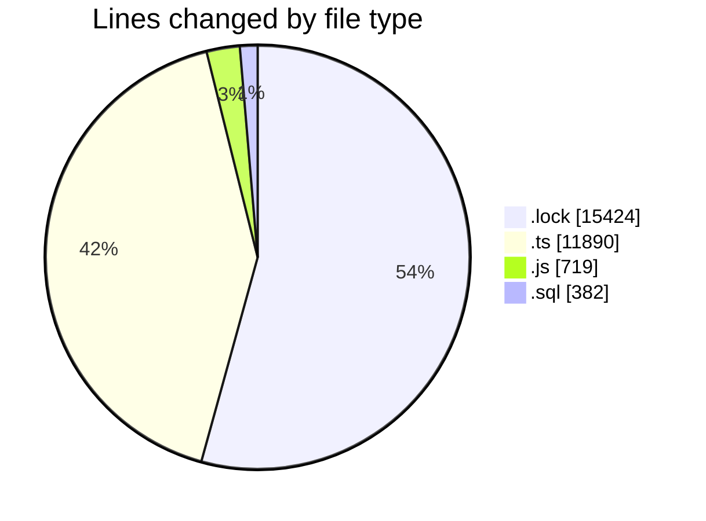
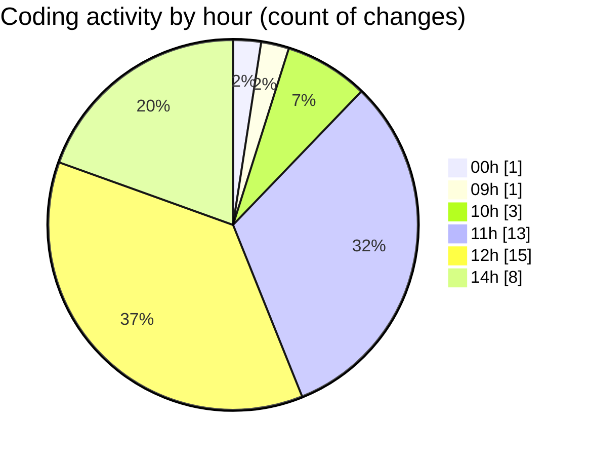

# cda - Activity Summary 

## Overall Statistics

| Stat                   | Value                                                             |
| ---------------------- | ----------------------------------------------------------------- |
| **Lines Added** (➕)   | 28381                                          |
| **Lines Removed** (➖) | 34                                        |
| **Net Change** (↕)    | 28347                |
| **Active Time** (⌚)   | 56 minutes |

## Modified Files
- **yarn.lock** (+15424, -0)
- **everywhere-queries.ts** (+299, -2)
- **yesalert-queries.js** (+667, -0)
- **everywhere.ts** (+239, -14)
- **yesalert.js** (+52, -0)
- **everywhere.ts** (+123, -8)
- **create-users.sql** (+382, -0)
- **everywhere.test.ts** (+157, -10)
- **resolvers-types.ts** (+11038, -0)

## Visualizations

### By File Type (Lines Changed)

### By Hour (Estimated Activity Count)

> **Last Updated:** 22/05/2025, 14:44:03