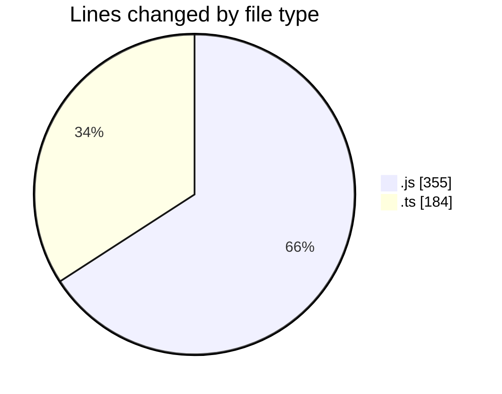
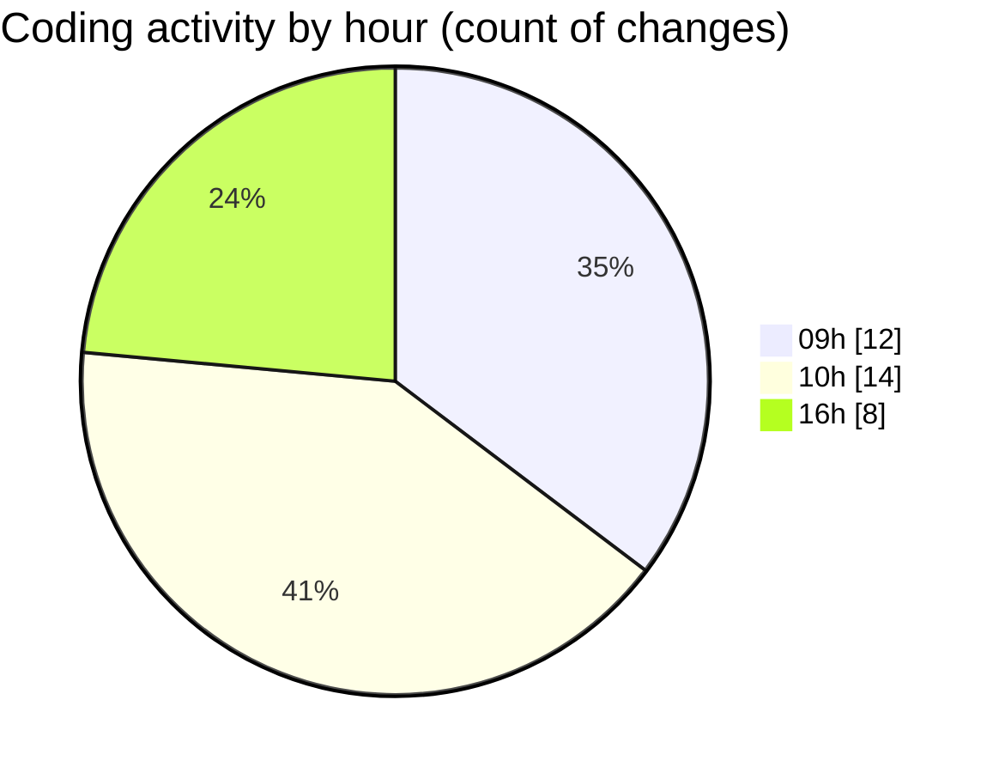

# cda - Activity Summary 

## Overall Statistics

| Stat                   | Value                                                             |
| ---------------------- | ----------------------------------------------------------------- |
| **Lines Added** (➕)   | 516                                          |
| **Lines Removed** (➖) | 23                                        |
| **Net Change** (↕)    | 493                |
| **Active Time** (⌚)   | 60 minutes |

## Modified Files
- **20250523082140-create-everywhe-reota-pattern-table.js** (+31, -8)
- **20250523085459-create-everywhere-rota-pattern-views.js** (+45, -15)
- **20250119174323-replace-everywhere-locations-view.js** (+39, -0)
- **everywhere-locations.js** (+103, -0)
- **everywhere.js** (+114, -0)
- **everywhere.ts** (+184, -0)

## Visualizations

### By File Type (Lines Changed)

### By Hour (Estimated Activity Count)

> **Last Updated:** 23/05/2025, 16:23:11