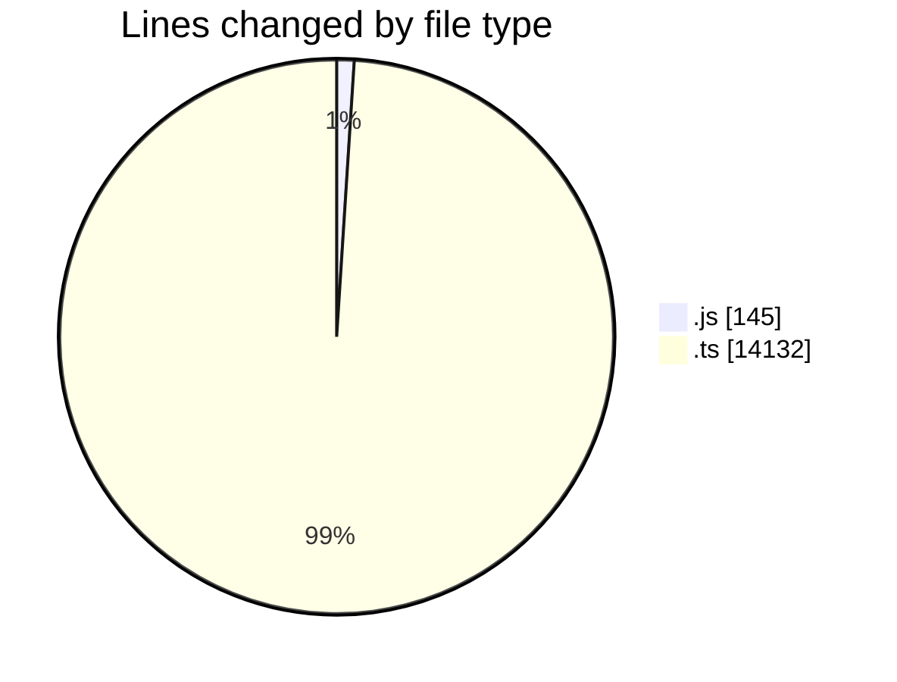
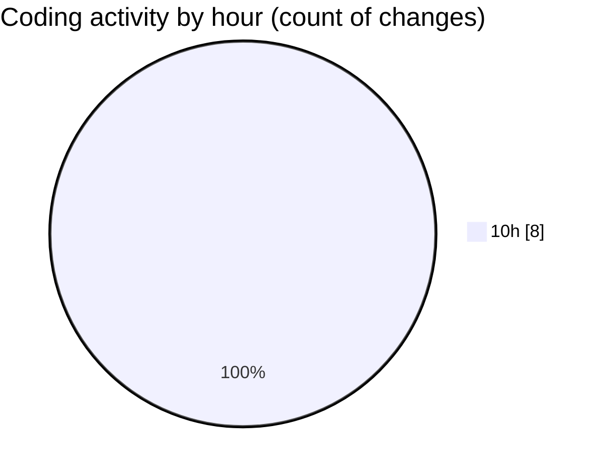

# cda - Activity Summary 

## Overall Statistics

| Stat                   | Value                                                             |
| ---------------------- | ----------------------------------------------------------------- |
| **Lines Added** (➕)   | 14277                                          |
| **Lines Removed** (➖) | 0                                        |
| **Net Change** (↕)    | 14277                |
| **Active Time** (⌚)   | 10 minutes |

## Modified Files
- **20250523085459-create-everywhere-rota-pattern-views.js** (+30, -0)
- **clear_view_controlled_tables.ts** (+596, -0)
- **tables.ts** (+5288, -0)
- **views.ts** (+8060, -0)
- **everywhere.ts** (+188, -0)
- **everywhere.js** (+115, -0)

## Visualizations

### By File Type (Lines Changed)

### By Hour (Estimated Activity Count)

> **Last Updated:** 27/05/2025, 10:49:24