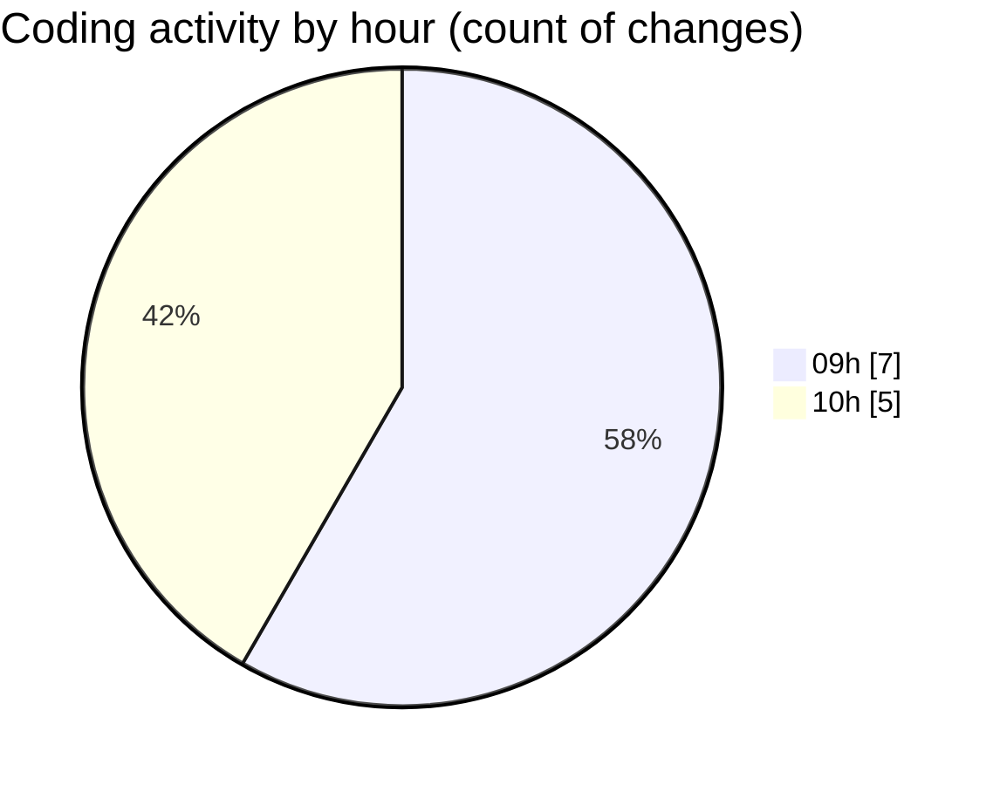

# cda - Activity Summary 

## Overall Statistics

| Stat                   | Value                                                             |
| ---------------------- | ----------------------------------------------------------------- |
| **Lines Added** (➕)   | 9271                                          |
| **Lines Removed** (➖) | 11                                        |
| **Net Change** (↕)    | 9260                |
| **Active Time** (⌚)   | 18 minutes |

## Modified Files
- **everywhere.ts** (+301, -4)
- **everywhere.js** (+124, -0)
- **everywhere-mutations.ts** (+303, -7)
- **everywhere.js** (+45, -0)
- **resolvers-types.ts** (+8379, -0)
- **everywhere.test.js** (+119, -0)

## Visualizations

### By File Type (Lines Changed)

### By Hour (Estimated Activity Count)

> **Last Updated:** 28/05/2025, 10:22:47