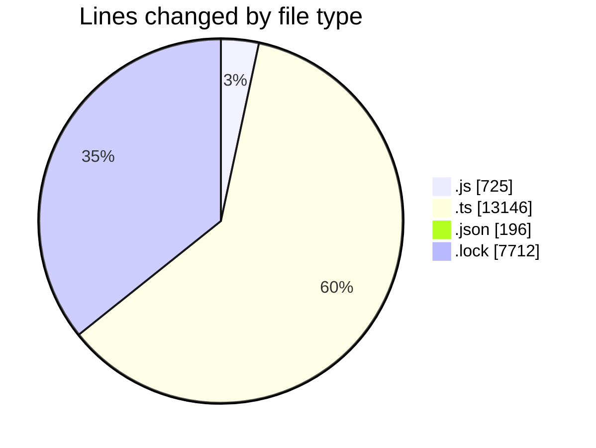
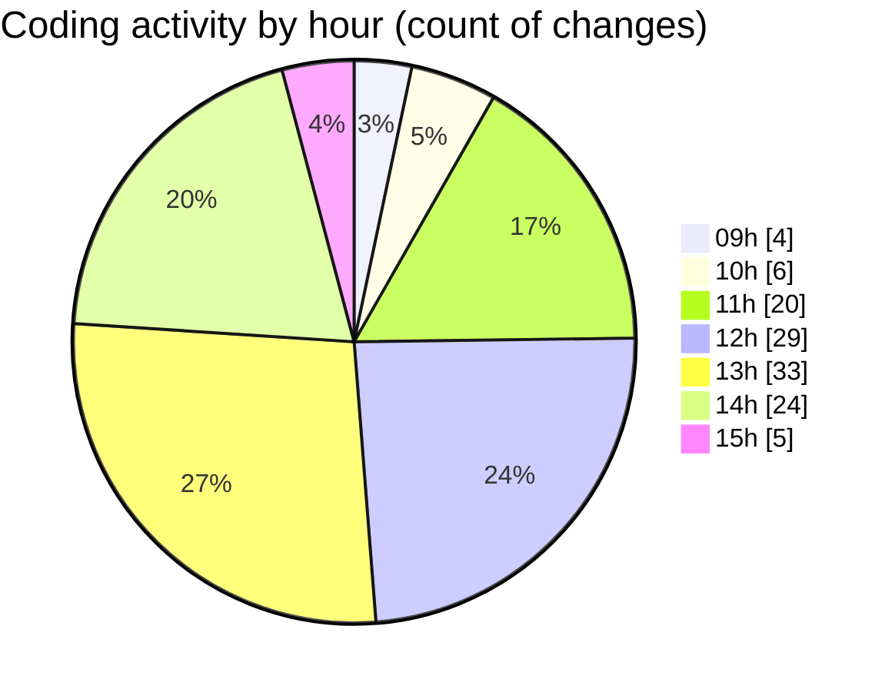

# cda - Activity Summary 

## Overall Statistics

| Stat                   | Value                                                             |
| ---------------------- | ----------------------------------------------------------------- |
| **Lines Added** (➕)   | 20583                                          |
| **Lines Removed** (➖) | 1196                                        |
| **Net Change** (↕)    | 19387                |
| **Active Time** (⌚)   | 184 minutes |

## Modified Files
- **everywhere.js** (+487, -15)
- **everywhere.ts** (+2460, -836)
- **everywhere.js** (+183, -4)
- **resolvers-types.ts** (+8443, -0)
- **settings.json** (+196, -0)
- **group.ts** (+97, -77)
- **rotaPattern.ts** (+113, -73)
- **activityFeed.ts** (+102, -45)
- **rotaPattern.test.ts** (+120, -63)
- **everywhere.test.ts** (+119, -52)
- **group.test.ts** (+67, -0)
- **activityFeed.test.ts** (+109, -30)
- **everywhere.ts** (+225, -0)
- **index.js** (+35, -1)
- **everywhere.ts** (+115, -0)
- **yarn.lock** (+7712, -0)

## Visualizations

### By File Type (Lines Changed)

### By Hour (Estimated Activity Count)

> **Last Updated:** 29/05/2025, 15:39:44