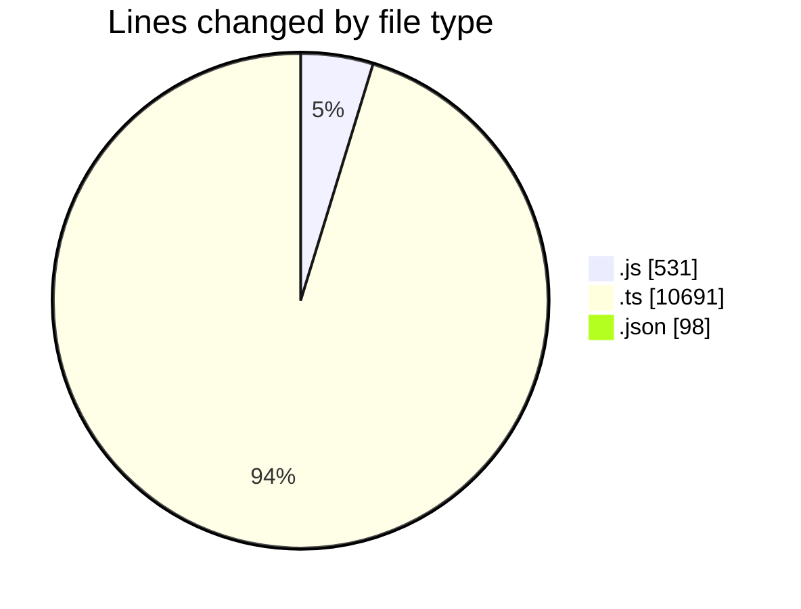
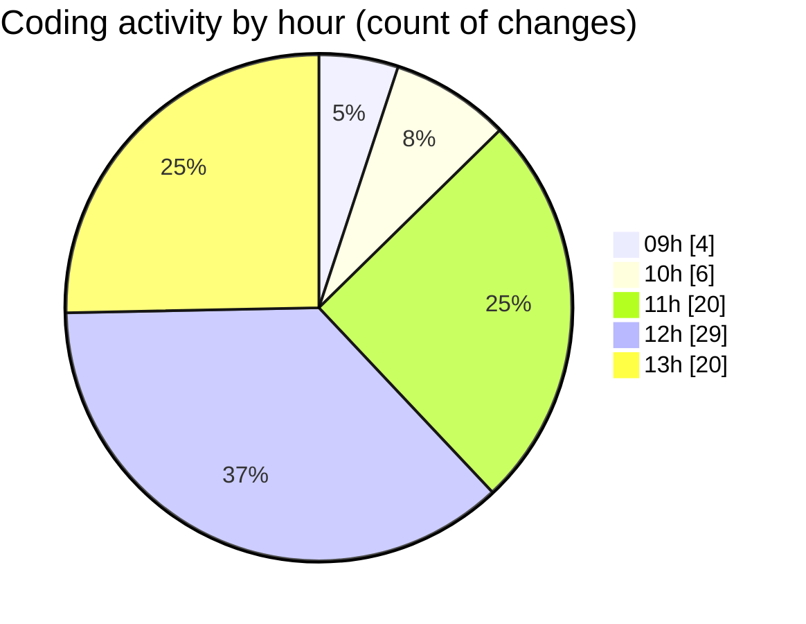

# cda - Activity Summary 

## Overall Statistics

| Stat                   | Value                                                             |
| ---------------------- | ----------------------------------------------------------------- |
| **Lines Added** (➕)   | 10816                                          |
| **Lines Removed** (➖) | 504                                        |
| **Net Change** (↕)    | 10312                |
| **Active Time** (⌚)   | 128 minutes |

## Modified Files
- **everywhere.js** (+329, -15)
- **everywhere.ts** (+1763, -485)
- **everywhere.js** (+183, -4)
- **resolvers-types.ts** (+8443, -0)
- **settings.json** (+98, -0)

## Visualizations

### By File Type (Lines Changed)

### By Hour (Estimated Activity Count)

> **Last Updated:** 29/05/2025, 13:45:43