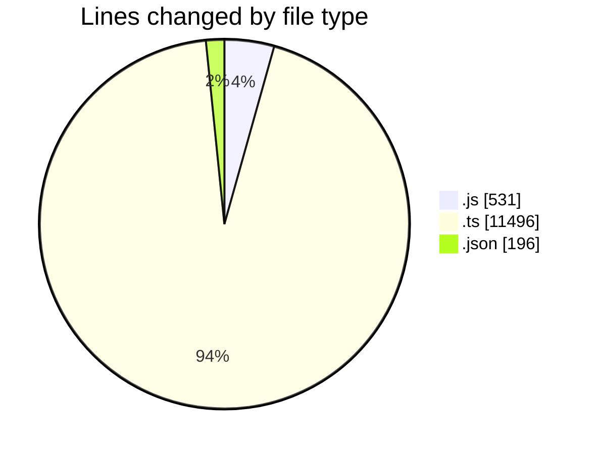
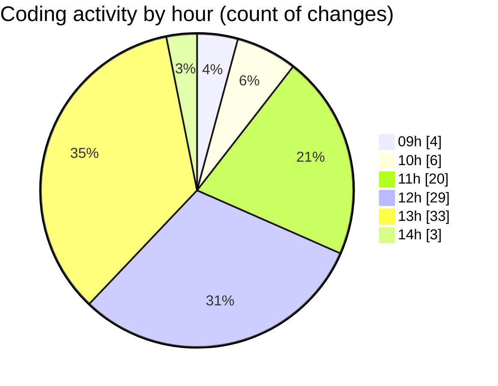

# cda - Activity Summary 

## Overall Statistics

| Stat                   | Value                                                             |
| ---------------------- | ----------------------------------------------------------------- |
| **Lines Added** (➕)   | 11424                                          |
| **Lines Removed** (➖) | 799                                        |
| **Net Change** (↕)    | 10625                |
| **Active Time** (⌚)   | 143 minutes |

## Modified Files
- **everywhere.js** (+329, -15)
- **everywhere.ts** (+1763, -485)
- **everywhere.js** (+183, -4)
- **resolvers-types.ts** (+8443, -0)
- **settings.json** (+196, -0)
- **group.ts** (+93, -73)
- **rotaPattern.ts** (+89, -62)
- **activityFeed.ts** (+89, -45)
- **rotaPattern.test.ts** (+120, -63)
- **everywhere.test.ts** (+119, -52)

## Visualizations

### By File Type (Lines Changed)

### By Hour (Estimated Activity Count)

> **Last Updated:** 29/05/2025, 14:09:44