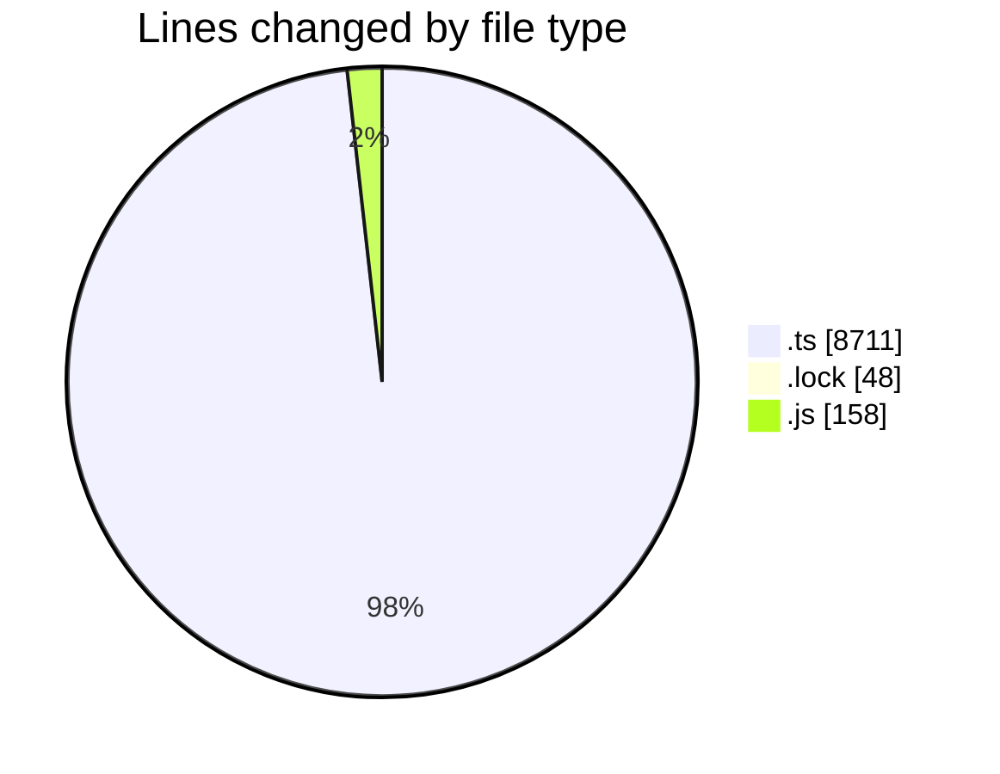
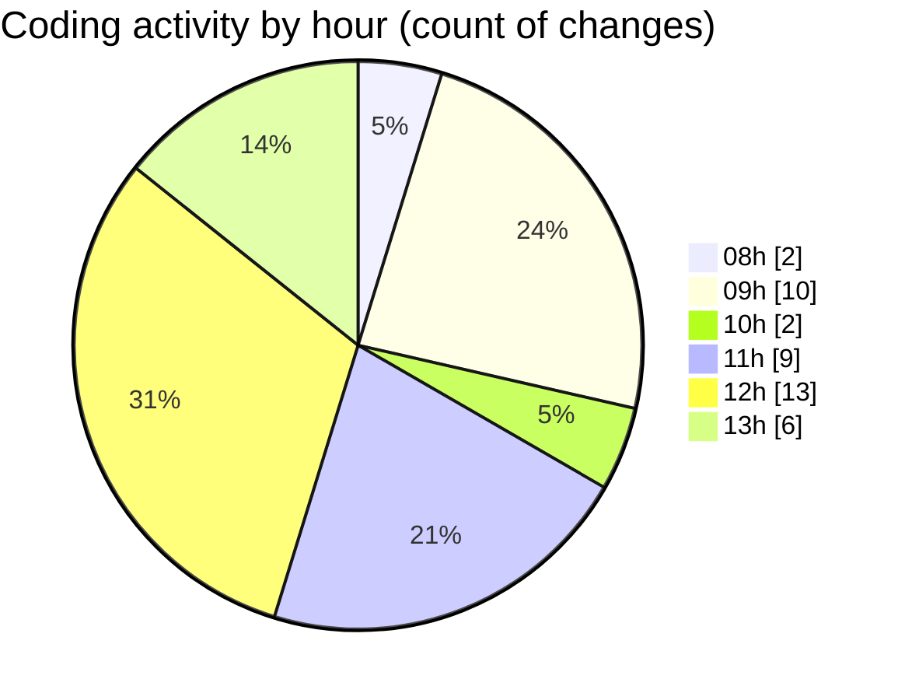

# cda - Activity Summary 

## Overall Statistics

| Stat                   | Value                                                             |
| ---------------------- | ----------------------------------------------------------------- |
| **Lines Added** (➕)   | 8669                                          |
| **Lines Removed** (➖) | 248                                        |
| **Net Change** (↕)    | 8421                |
| **Active Time** (⌚)   | 61 minutes |

## Modified Files
- **everywhere.ts** (+56, -126)
- **everywhere-queries.ts** (+18, -2)
- **everywhere.ts** (+78, -52)
- **yarn.lock** (+24, -24)
- **index.js** (+1, -0)
- **resolvers-types.ts** (+8379, -0)
- **everywhere.js** (+113, -44)

## Visualizations

### By File Type (Lines Changed)

### By Hour (Estimated Activity Count)

> **Last Updated:** 30/05/2025, 13:11:26