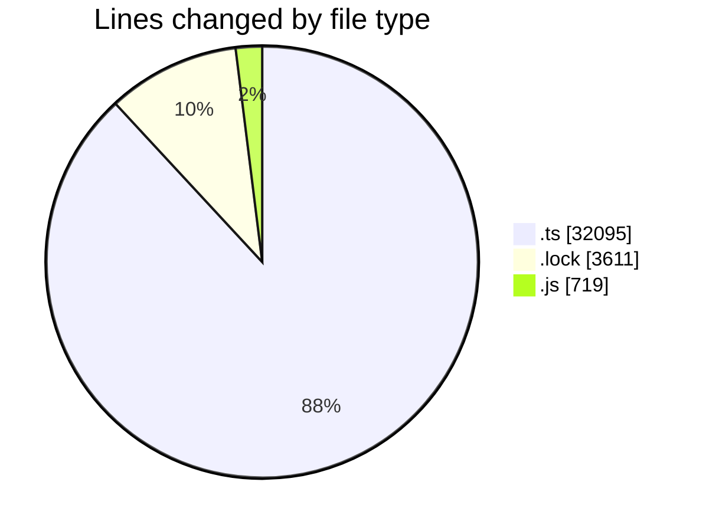
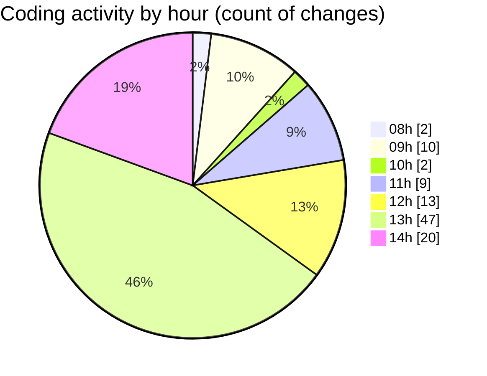

# cda - Activity Summary 

## Overall Statistics

| Stat                   | Value                                                             |
| ---------------------- | ----------------------------------------------------------------- |
| **Lines Added** (➕)   | 29956                                          |
| **Lines Removed** (➖) | 6469                                        |
| **Net Change** (↕)    | 23487                |
| **Active Time** (⌚)   | 153 minutes |

## Modified Files
- **everywhere.ts** (+503, -133)
- **everywhere-queries.ts** (+18, -2)
- **everywhere.ts** (+116, -90)
- **yarn.lock** (+56, -56)
- **index.js** (+1, -1)
- **resolvers-types.ts** (+24810, -5943)
- **everywhere.js** (+157, -86)
- **group.ts** (+4, -4)
- **activityFeed.ts** (+217, -152)
- **jdsd.ts** (+24, -0)
- **everywhere.js** (+158, -0)
- **yarn.lock** (+3499, -0)
- **everywhere.js** (+157, -0)
- **activityFeed.js** (+46, -2)
- **resolvers-types.js** (+111, -0)
- **activityFeed.test.ts** (+79, -0)

## Visualizations

### By File Type (Lines Changed)

### By Hour (Estimated Activity Count)

> **Last Updated:** 30/05/2025, 15:03:00