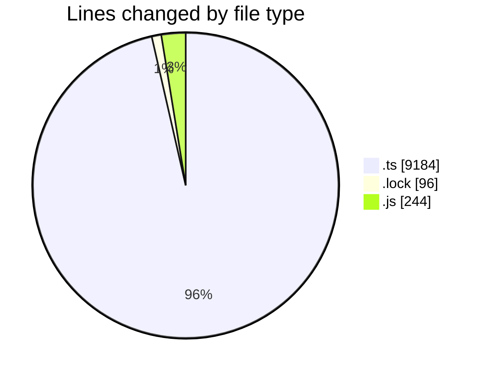
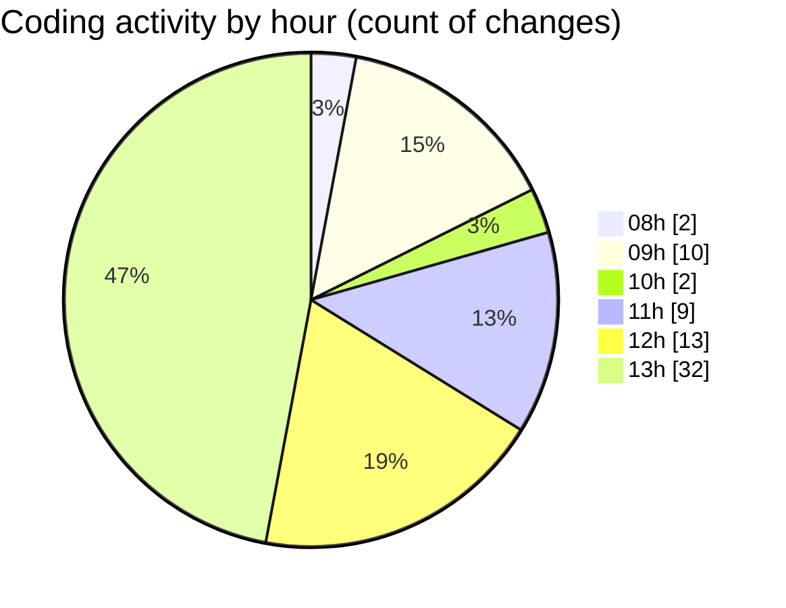

# cda - Activity Summary 

## Overall Statistics

| Stat                   | Value                                                             |
| ---------------------- | ----------------------------------------------------------------- |
| **Lines Added** (➕)   | 9071                                          |
| **Lines Removed** (➖) | 453                                        |
| **Net Change** (↕)    | 8618                |
| **Active Time** (⌚)   | 107 minutes |

## Modified Files
- **everywhere.ts** (+124, -126)
- **everywhere-queries.ts** (+18, -2)
- **everywhere.ts** (+104, -78)
- **yarn.lock** (+48, -48)
- **index.js** (+1, -0)
- **resolvers-types.ts** (+8443, -0)
- **everywhere.js** (+157, -86)
- **group.ts** (+4, -4)
- **activityFeed.ts** (+148, -109)
- **jdsd.ts** (+24, -0)

## Visualizations

### By File Type (Lines Changed)

### By Hour (Estimated Activity Count)

> **Last Updated:** 30/05/2025, 13:52:47