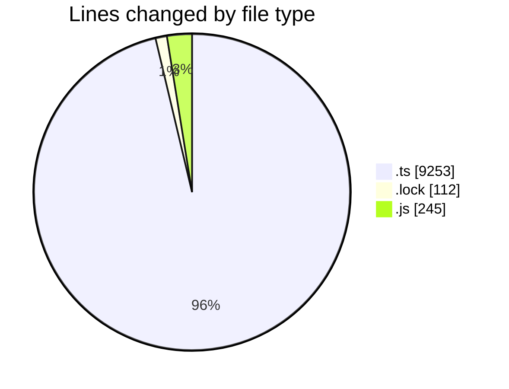
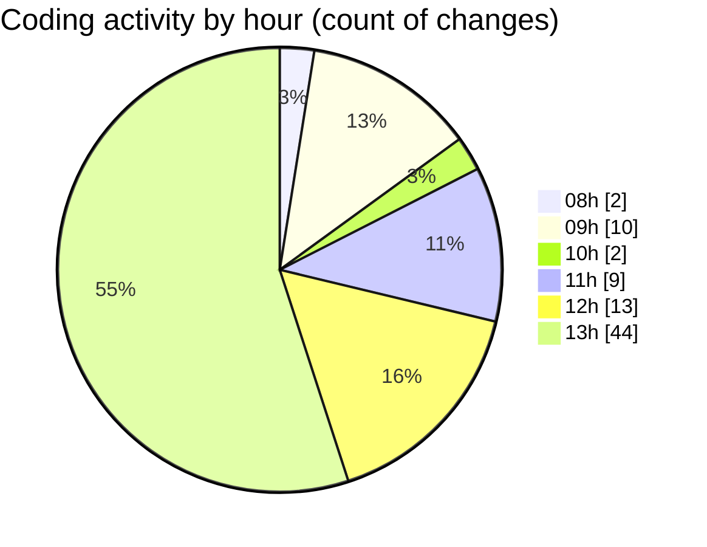

# cda - Activity Summary 

## Overall Statistics

| Stat                   | Value                                                             |
| ---------------------- | ----------------------------------------------------------------- |
| **Lines Added** (➕)   | 9091                                          |
| **Lines Removed** (➖) | 519                                        |
| **Net Change** (↕)    | 8572                |
| **Active Time** (⌚)   | 122 minutes |

## Modified Files
- **everywhere.ts** (+124, -132)
- **everywhere-queries.ts** (+18, -2)
- **everywhere.ts** (+112, -86)
- **yarn.lock** (+56, -56)
- **index.js** (+1, -1)
- **resolvers-types.ts** (+8443, -0)
- **everywhere.js** (+157, -86)
- **group.ts** (+4, -4)
- **activityFeed.ts** (+152, -152)
- **jdsd.ts** (+24, -0)

## Visualizations

### By File Type (Lines Changed)

### By Hour (Estimated Activity Count)

> **Last Updated:** 30/05/2025, 13:57:47